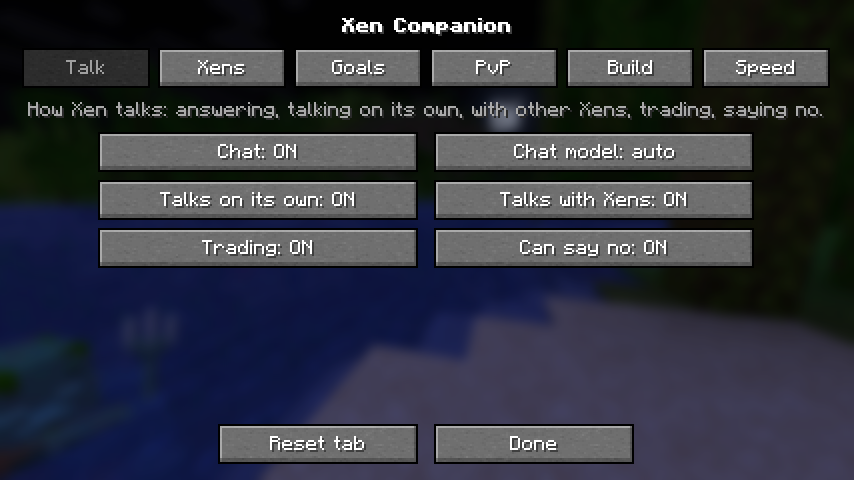
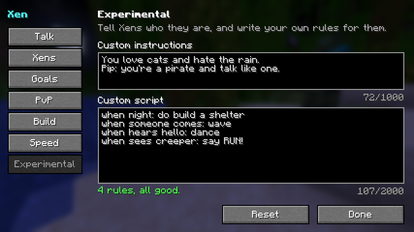

# Xen

light weight DMM for Minecraft named Xen

Xen is a decision-making model that plays Minecraft. It makes a new decision
every moment (press keys, mine blocks, fight, eat, place blocks), and it
learns from everything that happens. It **thinks**: it imagines what its
options lead to before choosing. It **feels**: pain, fear, curiosity,
satisfaction and boredom, because fear is how it learns to stay alive.

It **plays fair**. It isn't handed the world like most game AIs. It knows
everything within 6 blocks of itself, and beyond that only what it *sees* in
its 90° field of view, up to 8 chunks away. Things behind walls, under the
ground or behind its back stay unknown, and what it saw before is a belief
whose confidence fades.

On top of survival it has skills: it **builds** from templates (roofs, arches,
houses, towers, bridges), **rates** builds and learns your taste in buildings,
and **learns redstone** by experimenting. It **chats**: ask it for things in
plain words ("Xen, get me some wood", "build a shelter", "follow me") and it
does them, with its own hands and senses. A small local chat model
(SmolLM2-360M) helps it understand and answer, and it only knows what Xen
knows. In real Minecraft you can bring in as many Xens as the server allows.
Each one is a real player with its own name, skin and personality, and they
all share one brain. With evolution, the ones that do well pass their nature
on.

**Want it in your world?** Get the survival-companion mod from the
[Releases](https://github.com/JAK-cool162/Xen/releases) page or
[`dist/`](dist/README.md) (Fabric, Minecraft 1.21.11 and 26.x, x86-64 and
ARM64, also on Android launchers). The mod has the trained brain inside and
needs no Python. Settings are in Mod Menu. It's a prototype.

The Python side only needs Python 3.9+ and numpy. No GPU and no deep-learning
framework.

```
pip install -r requirements.txt
python -m xen train --lives 50      # grow up in SimCraft (built-in Minecraft-like world)
python -m xen watch                 # watch it live, with its inner monologue
python -m xen evaluate --baseline   # what it learned, compared with a newborn
```

---

## How Xen works

Every tick Xen goes through the same loop (`xen/brain/agent.py`):

| step | brain part | what happens |
|---|---|---|
| perceive | `perception.py` | what it knows for sure (every block within 6 blocks, turned so "forward" is where it looks), what it sees (256 rays in a 90° view, up to 128 blocks), what it believes is out there (and how sure it is), and its own body (health, hunger, being hurt...) |
| feel | `brain/emotions.py` | the **amygdala** predicts how much harm each action leads to; that becomes felt **fear** |
| think | `brain/cortex.py` | if afraid (or unsure), it **imagines** its best options a few steps ahead with its world model and weighs imagined reward against imagined harm |
| decide | `brain/agent.py` | picks the action with the best *reward − caution × fear*; when exploring it's curious but cautious |
| act | `actions.py` | real Minecraft inputs: W/A/S/D, jump, turn, look, mine (hold left click), place, attack, eat |
| learn | `brain/critic.py`, `brain/memory.py`, `brain/world_model.py` | stores what happened and trains everything, continuously |

### What Xen can sense (it can't cheat)

`xen/perception.py` gives Xen the senses of a player, not a map of the world:

* **Up close it knows everything.** Every block within 6 blocks (a 13×13×13
  cube), including what's under its feet and behind it. That's what a player
  knows from walking around and hearing.
* **Further away it has to look.** Its eyes cast 256 rays in a 90° field of
  view, up to 8 chunks (128 blocks). Rays stop at solid blocks and lava and pass
  through air, water and glass, so it can't see ores inside the hill, caves
  under the ground or anything behind it. Unloaded chunks are unknown.
* **Beliefs with confidence.** What it saw goes into a belief map ("coal
  there, 20 blocks away"). The confidence fades once it looks away: blocks
  lose half their confidence in 2 minutes, mobs in 3 seconds because they move.
  When it looks again the belief is corrected, or forgotten if the thing is
  gone.
* Its observation is made from that: the full near cube, a coarse picture of
  its view (distance and what each ray hit, per sector), pointers to the
  nearest believed treasure, lava and mob with their confidence, and its body.

The same senses run in SimCraft, in the mineflayer bridge (`bridge/xen_bridge.js`)
and in the mod (`mod/common/java/xen/mod/WorldSenses.java`). The mod's
`crossCheck` task checks that the Java version gives the same observation as
the Python one.

### Why Xen needs fear

Fear is the signal that teaches it to survive:

* **Pain**: harm happening right now (damage, burning, death). This is the teacher.
* **Fear**: harm it *expects*. The amygdala is a critic trained on harm instead of
  reward. It learns cue → consequence one step at a time, so fear stays specific
  (walking *into* lava is terrifying, stepping away from it is not).
* **Trauma memory**: moments that hurt, together with the moments that led up to
  them, are replayed far more often than ordinary memories. One burn is enough to
  start fearing lava (fear conditioning). The latest 1000 of these memories (and
  of the best moments, its joy memory) are saved with the brain, so they go
  wherever it goes. A brain that keeps learning in a world where it never meets
  lava still replays the burns, and doesn't forget to fear it.
* **Caution**: being hurt makes Xen more careful for a while (sensitisation); safe
  time calms it down again (habituation).
* **Exposure**: it sometimes tries even what it fears. Without that, avoidance would
  keep an unfounded fear alive forever. With it, harmless things stop being scary
  (extinction).
* **Fear makes it think**: when afraid, it stops acting on instinct and imagines
  where each option leads before choosing.

The other feelings: **curiosity** (its world model was surprised) pushes it to
explore; **joy memory** replays big rewards (a diamond makes digging feel worth
it); **satisfaction** wears off for things it already has plenty of (the 30th
cobblestone is worth much less than the first); **boredom** builds up when
nothing changes around it (turning on the spot doesn't count as a change), so
it never loops on a pointless action.

Watching it (`python -m xen watch`) shows the feelings and the inner monologue:

```
pain ---------- fear ######---- curiosity #--------- satisfaction ---------- caution  4.0  mood: afraid
action: BACK       (thought)
Xen: I'm afraid; I don't want to walk forward. Thinking it through (step back +0.41, turn left +0.12, ...) -> I'll step back.
```

### SimCraft: where Xen grows up

`xen/worlds/simcraft.py` is a small, fast voxel world with the parts of Minecraft
that matter for learning: terrain with trees, dirt and stone; ores that get
richer (and more dangerous) the deeper it goes; caves; lava (often hidden right
next to diamonds); water; fall damage; day and night; zombies; hunger and food.
It uses the same actions and the same perception as the real game, so what Xen
learns there carries over.

```
python -m xen train --lives 200 --brain xen_brain.npz    # keeps learning where it left off
python -m xen evaluate --brain xen_brain.npz --baseline
```

A pre-trained brain comes with the repo (`brains/xen_simcraft.npz`, 220 lives,
about 214k decisions, all with the fair senses). Every command starts from it
when you don't have your own brain file yet (use `train --fresh` for a
newborn). The mod has the same brain inside.

**What it learned** (reward = value of what it mined and collected in one life,
while still exploring):

| lives | average reward per life | survived |
|---|---|---|
| 1-44 | 13.1 | 19/44 |
| 45-88 | 15.2 | 20/44 |
| 89-132 | 19.2 | 14/44 |
| 133-176 | 20.2 | 26/44 |
| 177-220 | 22.8 | 21/44 |

`python -m xen evaluate --lives 8 --baseline` (8 fixed worlds, no exploring,
and the 30th cobblestone is worth less than the first):

```
trained  reward per life  33.78 | survived 7/8 (deaths: starvation x1)
newborn  reward per life   3.96 | survived 1/8 (deaths: zombie x5, lava x2)
```

Its fear is learned, and it's specific (how much harm the amygdala expects):

| situation | trained Xen | newborn |
|---|---|---|
| walk forward into lava vs onto ground | 0.167 vs 0.007 | 0.014 vs 0.003 |
| dig straight down onto lava vs onto stone | 0.063 vs 0.000 | 0.000 vs 0.009 |
| a zombie in its face vs nothing there | 0.014 vs 0.002 | 0.026 vs 0.032 |

It still dies more often than a good player. Deep digging for ore means lava
and zombies, and more training makes it better.

### What it learned by itself

Nothing below is a rule in Xen's code. SimCraft only has physics, rewards (the
value of what it mines and eats) and harm. Same situations for the trained
brain and a newborn, 12 fixed worlds each, no exploring, the choices it made
most often:

| situation | trained Xen | newborn |
|---|---|---|
| diamond right in front | mines it (5 of 12) | never mines (eats 6, turns 2) |
| iron right in front | mines it (4) | never mines (eats 3) |
| looking down, lava 2 blocks below | **never digs** (walks on 3, looks 2) | digs down (5) |
| looking down, stone below | digs down (5) | digs (3) |
| stone in front, already carrying 64 cobblestone | mostly doesn't bother | mines it (3) |
| a zombie in its face | backs off or sidesteps (4) | random |
| nothing around | looks down at the ground (7): a miner's habit, that's where ore shows | random |

So it worked out "don't dig straight down onto lava" (but do dig onto stone),
that ore is worth taking, and that more stone isn't. It did **not** learn to
eat when hungry, which is why the mod has an eating instinct.

### Training in real Minecraft

The mod keeps learning while it plays. For long runs, `/tick sprint` speeds up
the game and Xen's learning together, so it stays fair: Xen gets the same
number of decisions and learning steps per game tick as at normal speed, just
sooner. Every life is logged in `<world>/xen/lives.csv`.

* **100 real days (8 Xens)**: it made the brain worse. Real Minecraft rewards
  are rarer than SimCraft's, and the brain slowly forgot to fear lava because
  it hardly met any. That's why its trauma and joy memories are now saved with
  the brain and keep being replayed. With them, a second run kept the fear
  (0.146 for walking into lava vs 0.013 onto ground).
* **30 real days with evolution (8 Xens)**: evolution picked brave Xens,
  and the brain learned to fear zombies but got worse at SimCraft's tests
  ([the results](#evolution-30-days-in-real-minecraft)).

The bundled brain is still the SimCraft one, since it's the best at SimCraft's
tests. The 30-day brain is an experimental download on the release page.

---

## Playing real Minecraft

### Survival companion mod (Fabric, easiest)

[`dist/`](dist/README.md) has the mod, with requirements, commands and
settings:

| jar | Minecraft | Java |
|---|---|---|
| `dist/xen-companion-0.7.0-alpha+mc1.21.11.jar` | 1.21.11 (also on phones) | 21+ |
| `dist/xen-companion-0.7.0-alpha+mc26.x.jar` | 26.1 - 26.3 | 25+ |

The [Releases](https://github.com/JAK-cool162/Xen/releases) page also has
**all-in-one** jars (`...-with-chat.jar`, about 400 MB): the mod with its
chat model (SmolLM2-360M) inside, so Xen talks with nothing else to download.
The mod unpacks the model once into `config/xen/` and checks its SHA-256.
(`python scripts/bundle_chat_model.py <mod jar> <model>` makes one.)

The mod and its chat model are plain Java with no native code, so the same jar
runs on x86-64 and ARM64 (phones, Raspberry Pi, Apple Silicon). Every push is
checked on both an x86-64 and an ARM64 machine
([`.github/workflows/check.yml`](.github/workflows/check.yml)).

Put it in `mods/` with Fabric API and run `/xen summon`. Xen joins as a real
player next to you and **lives its own life** like another player: tools, its own
house, a crop farm, mining for iron and diamonds, smelting, armor, a mob farm
(or it follows you or stays when you ask). Its **path assist** finds the way like
a good player (sprint, jump gaps, drop down, swim, climb, open doors, dig through,
bridge, tower out of holes), a **solver** learns ways out when it's stuck (also
from watching you), fights can end in a **truce**, and `/xen minions` gives it
sidekicks that don't load chunks and help it build a village. It mines, fights back, swims, eats and learns. Right-click it to
open its bag. `/xen spawn 50` (operators) brings in a crowd of Xens across the
world, all sharing one brain. Everything runs inside the game (brain,
learning, senses and chat), with no Python and no bridge. It was tested on
Fabric servers for 1.21.11, 26.1.2 and 26.3.

**Ask it for things.** Say its name and what you want: follow, stay, explore,
get wood / stone / coal / iron / ore, hunt for food, give you its items, craft
something ("craft a boat"), build a shelter, eat, stop (typos like "fallow me" and Thai work too). It goes for
blocks and animals it knows about (felt within 6 blocks, spotted within 14, or
seen further away in its view), mines whatever it can see and reach like a
player, picks up what drops, and looks around when it knows of none. It
finds its way through the blocks it knows (pathfinding over its 13×13×13 cube)
and digs only when there's no way. It says what it will do, or exactly why it
can't. From test runs on a real 1.21.11 server:

```
<Steve> Xen, get me 2 logs
<Xen> Okay! I'll get 2 wood from the tree I know is 3 blocks from me.
<Xen> Got 2 wood!
<Steve> xen build a shelter
<Xen> Okay! I'll build a small shelter around myself with 8 blocks.
<Xen> Done! I'm safe in my little shelter.

<Steve> xen, kill a pig
<Xen> Okay! I'll hunt the pig I see 3 blocks away for food.
<Xen> Got some food!
```

**Every Xen is someone.** New Xens get a personality (brave or timid,
curious, chatty or quiet, patient or impatient, and a tone of voice: cheerful,
calm, grumpy, shy, bold or silly), a name that fits it (a silly one may be
WobblyNoodle, a grumpy one SaltyBadger; or a gamer tag like Pickle_42, a
made-up word like Zorbax, or a classic like Pip) and a skin: one of the mod's
own 61 ([`docs/skins`](docs/skins/README.md), free to use), Minecraft's 18,
your own PNGs in `config/xen/skins/` (from NameMC, Planet Minecraft or drawn
yourself: signed once through mineskin.org so everyone sees them), random ones
from mineskin.org's gallery, or a player's (`/xen set skins player:Name`). The genes
really change how it plays: a timid Xen weighs fear up to 1.6x, a curious one
tries new things up to 1.5x as often, a patient one keeps at a chore longer.

Each Xen also gets **fight genes** (ten 1.9+ PvP skills, starting from one of
five styles: brawler, rusher, skirmisher, guard or dancer) and a **building
style** (the shelter it builds is a hut, a fort or a tower, of stone, dirt or
whatever it has). Children inherit them. Set them by hand with
`/xen style Pip fight guard` or `/xen style Pip crit 0.9`.

**PvP like a 1.9+ player.** PvP is `own` (the default: its own call, see
above), `off`, `defend` (always fights back against a player who attacks it or
its owner with a weapon) or `teams`. It plays by the server's rules
with a player's inputs: critical hits on the way down with sprint released,
full-charge swings, sprint hits with S-taps in between, jump resets, spacing
at the edge of its reach, stepping out of the foe's crit jump, hit selecting,
shields (raised while recharging, an axe against the foe's), and golden
apples when badly hurt. Against a scripted fighter with the same sword that
strikes first, a brawler Xen now wins about half its fights (the last version
won none).

**It trains against itself: red against blue.** `/xen arena start 4 40 sword`
builds an arena in the sky and pits red Xens against blue ones in duels, with
the same kit. Every few rounds each team evolves its fight genes (children of
its best replace its worst; a team that falls behind learns from the enemy),
and new Xens are born with the champions' genes. In a 40-generation run both
teams found the same way to fight: always crit, swing as soon as the sword
allows, fight at the edge of reach, S-tap and jump-reset, and never wait or
back off. Blue started as circling dancers, lost 11 of 12 fights by
generation 20, then learned from red and caught up (6-6 by generation 31).
The champion it evolved beats the careful styles, but not yet the best
aggressive ones: self-play confirmed what works with these skills, without
yet finding anything better.

**Goals in three tiers.** What it's doing this moment (eating, fighting,
getting away from a creeper), what it wants in the next minutes when it's free
(food, a shelter for the night, wood, stone, ore, a trade, exploring: weighed
by what it needs, its personality and what worked before), and a dream it
works toward for days (a home, a stockpile, diamonds, being a trader, far
places, three friends). When a dream comes true it's proud and picks a new one.

**It crafts its tools** like a new player, with the recipe book: planks,
sticks, a crafting table, a wooden pickaxe, then stone tools. It mines only
what's worth it and never digs straight down (it digs a staircase, and one up
to get out of a hole). **Next to you it gets on with things by itself** (wood,
stone, food, ore, a shelter at night) and drops them to keep up when you
leave. With good health it drops down 4 or 5 blocks like a player would.

**It acts like a player around people.** A few quick crouches at it are a
friendly hello: it crouches back and trusts you a little (never fully). A
punch with an empty hand just gets its attention ("Hey! What's up?"); only a
weapon (or poking on and on) is an attack. PvP is its own call by default: it
fights back against armed attacks on it or its owner, forgives a friend's
mistake, and runs when it's losing. Asked for its things, it thinks first and
keeps what it needs ("but keep 10 for a shelter tonight"). You don't need its
name when it's obvious you're talking to it, it remembers what you tell it
("remember that the base is by the big oak"), and it reads signs. It takes
knockback like any player, runs when there's far to go, can't see far in the
dark (and lights caves with torches), and doesn't know about ore buried in
stone.

**It's unpredictable.** Crouch up and down next to it and it dances along
(other Xens join in); now and then it shows off a trick ("Watch this!") that
doesn't always work ("I meant to do that."); in a fight it may take a snack
break in front of a nearly beaten foe.

**It knows how mobs behave.** It leaves endermen, piglins and other neutral
mobs alone unless they come after it, never hits villagers, golems or pets,
and runs from a hissing creeper.

**It trades and bargains.** "Xen, trade with the villager": it opens the
villager's trading screen and takes the offers that are good for it, with a
player's clicks. With players it names prices, answers low offers with
counter-offers (high first, then halfway, then its last offer), walks away
from bad deals, and gives friends a better price. It remembers whom it trusts:
someone who hit it or didn't pay gets no deals.

**It can say no**, and says why: when it's badly hurt, scared, needs what you
ask for, or you hurt it ("No, not now: I'm badly hurt and need to heal
first."). "Please" changes its mind, unless you hurt it.

**It learns by watching you.** When a move works out for you, it copies it,
clumsily at first and better each time: land a water-bucket clutch in front of
it and it starts doing water clutches when it falls; win a fight and it fights
a bit more like you (crits, S-taps, jump resets, the shield).

**It talks on its own and with other Xens**, only about what's true for it: it
greets you, says how its dream is going, and asks yes-or-no questions it acts
on ("I have lots of wood. Want some?" "yes"). Two Xens that meet chat and tell
each other where they saw trees and ore, and the other one then knows it.
Everyday questions ("what are you doing?", "what do you have?") are answered
straight from what it knows, not by the chat model.

**Small redstone.** "Xen, build a NOT gate" (also OR, AND and a repeater wire):
circuits it worked out itself in its redstone lessons, placed part by part by
hand. Capped at 24 parts by default so nothing big slows the server.

**The chat model can run on your graphics card** (setting `gpu`, auto by
default): its own hidden OpenGL 3.3 context and plain shaders, so it works with
vanilla, Sodium, Iris or Vulkan renderer mods alike, and falls back to the CPU
by itself.

**The chat model only wakes when it's needed**: when someone the Xen knows is
within 32 blocks, or someone talks to it. It unloads after 10 quiet minutes.
When nobody it knows is around, Xen leaves notes on signs instead ("Day 12:
Diamonds here! -Pip").

**Settings in Mod Menu** (or `/xen set` on servers), with the categories down
the left: Talk (chat, the chat model, talking on its own and with Xens,
trading, saying no), Xens (how many, names, personalities, skins), Goals (own
goals, antics, learning by watching, evolution), PvP, Build (redstone, signs),
Speed (GPU, decisions, threads) and **Experimental**:

* **Custom instructions**: who your Xens are ("You love cats and hate the
  rain. Pip: you're a pirate and talk like one."). A line starting with a
  Xen's name is only for that Xen. The chat model reads them; without it, Xen
  still answers from them ("do you like cats?" "I love cats.").
* **Custom script**: your own rules, `when <something>: <what to do>`, one per
  line: `when night: do build a shelter`, `when someone comes: wave`,
  `when hears hello: say Hi {player}!`, `when sees creeper: say RUN!`,
  `when every 10 minutes: show off`. When: night, morning, rain, hungry, hurt,
  attacked, diamonds, someone comes, sees a mob, hears a word, every N
  minutes. Do: say, any request (`do ...`), dance, spin, wave, show off. The
  box tells you which lines it can't read. (With `/xen set script`, put `|`
  between rules.)





The full list of requests, settings and phone launchers (Zalith Launcher 2,
PojavLauncher, Amethyst) is in [`dist/README.md`](dist/README.md).

#### Evolution: 30 days in real Minecraft

With evolution on, every few days the worst quarter of the ownerless Xens
leave and children of the best half take their places. Each gene comes from
one of two parents, with a small mutation. All Xens still share one brain:
what evolves is their nature. Your own Xens are never replaced.

A 30-day run in real Minecraft (8 ownerless Xens, a new generation every 3
days, sprinted with `/tick sprint`), from `<world>/xen/evolution.csv`, the
average genes of the Xens alive:

| day | generation | bravery | curiosity | chattiness | patience |
|---|---|---|---|---|---|
| 3 | 1 | 0.37 | 0.45 | 0.60 | 0.51 |
| 6 | 1 | 0.43 | 0.46 | 0.62 | 0.59 |
| 9 | 2 | 0.62 | 0.48 | 0.57 | 0.64 |
| 12 | 3 | 0.60 | 0.50 | 0.52 | 0.58 |
| 15 | 3 | 0.84 | 0.57 | 0.54 | 0.60 |
| 18 | 3 | 0.86 | 0.51 | 0.47 | 0.64 |
| 21 | 4 | 0.84 | 0.47 | 0.45 | 0.59 |
| 24 | 2 | 0.85 | 0.57 | 0.52 | 0.51 |
| 27 | 4 | 0.84 | 0.52 | 0.52 | 0.53 |
| 30 | 5 | 0.75 | 0.50 | 0.55 | 0.49 |

* **Bravery is what gets selected**: from 0.37 to about 0.85 in 15 days, and
  it stayed there. Brave Xens explore and gather more, and that outweighed
  dying a bit more often.
* Curiosity and chattiness drifted around 0.5: they don't change how well a
  Xen does, so nothing selects them. Patience rose while there were chores to
  finish, then drifted back.
* All 15 deaths were in the first 10 days (11 drowned, 2 skeletons, 2
  zombies), none in the last 20. But the Xens also gathered less and less: they
  learned to stay safe more than to work.

**What 30 real days did to the shared brain** (the same fixed SimCraft
worlds, no exploring):

| | bundled brain | after 30 real days |
|---|---|---|
| reward per life | 32.6 | 2.3 |
| survived | 6 of 8 | 3 of 8 |
| fear of walking into lava vs onto ground | 0.167 vs 0.007 | 0.045 vs 0.015 |
| fear of a zombie in its face vs nothing | 0.014 vs 0.002 | **0.177** vs 0.013 |

It learned to fear zombies (they and skeletons killed it in the real game).
But real Minecraft pays for mining and little else, so it now mines almost
anything, even digging down toward lava. So the bundled brain stays the
SimCraft one. The 30-day brain is on the release page as an experiment
(`xen-brain-30days-experimental.bin`).

A brain trained in Python can go into the mod: `python -m xen export --brain
xen_brain.npz --out brain.bin`, then copy it to `<world>/xen/brain.bin`.

### As a mineflayer player (Java Edition 1.21.11; mineflayer also joins 26.1)

Each Xen is a [mineflayer](https://github.com/PrismarineJS/mineflayer) bot: a real
player connection. The server treats it like anyone else: it shows up in the
player list, takes damage, has an inventory, can chat, and can be given /op.
Its perception is the same block cube as in SimCraft, so the trained brain
works in the real game and keeps learning there.

1. Run a server (or open a single-player world to LAN) with `online-mode=false`
   in `server.properties`, so Xens can join without Microsoft accounts.
2. Start the bridge (Node.js 18+):
   ```
   cd bridge && npm install
   node xen_bridge.js --host localhost --port 25565
   ```
3. Start Xen:
   ```
   python -m xen play --world mineflayer
   ```

### Swarm: as many Xens as the server holds

```
python -m xen swarm --count 0 --spread 300
```

* `--count 0` keeps bringing in new Xens (`Xen`, `Xen_2`, `Xen_3`, ...) until the
  server is full, then keeps trying now and then as slots free up. Use a
  number for a fixed swarm. Raise `max-players` in `server.properties` for a
  bigger swarm.
* `--spread 300` scatters each new Xen up to 300 blocks away across the world
  (uses `/spreadplayers`, so the Xens need op; `/op Xen_2` etc., or use the
  `spawnRadius` gamerule).
* One brain drives all of them: every body's experience, and every body's pain,
  trains the same mind, so the swarm learns faster the bigger it gets. Each body
  still has its own feelings.

### Chat with Xen

Chat is how you ask Xen for things, and it answers. The mod does all of it (see
above). With the bridge, start Xen with `--chat` (`python -m xen play --chat`,
`python -m xen swarm --chat`) to have it answer in its own words.

It understands in two steps (`xen/talk/chat.py`, the same rules in the mod's
`Chat.java`): clear keywords first, and when there are none, the chat model
(SmolLM2-360M-Instruct, on the CPU, no GPU) picks one of the things it can do,
but only when that's clearly likelier than just talking. Questions and thanks
are always just talk. On 46 test phrases, keywords alone understood 32 and the
two steps together 41. None of the 10 plain-chat phrases turned into an
action. The rest of the misses became plain talk instead of a wrong action.

It **can talk but can't cheat**:

* its prompt is Xen's own notes: its feelings, body and inventory, and what it
  perceives, worded with how sure it is ("You know there is lava 3 blocks from
  you. You think there was iron about 40 blocks away, but you're not sure.");
* a sentence that claims something that isn't in its notes (ores, lava, mobs,
  villages...) is dropped before it's sent, and so is a promise to do
  something (talk can't make it act, only requests can);
* for a request it says its plan in plain words, never the model's version of
  it, so it can't misstate what it's doing;
* it only chats: one line, up to two sentences, never a command (a reply can't
  start with `/`).

The model downloads once (about 390 MB) to `~/.xen/models`, or set
`XEN_MODEL` to a GGUF file you have. Without it, Xen still understands
keywords and answers in plain words from its notes.

```
$ python -m xen chat "Xen, what do you see?" "go see what's out there"   # in a SimCraft world
Xen's notes: You feel calm. You know there is a tree 6 blocks from you.
<You> Xen, what do you see?
<Xen> I can see a tree about 6 blocks from me.
<You> go see what's out there
  (understood: explore)
<Xen> I can see a tree about 6 blocks away.
```

In the mod on a real server (a flat world full of slimes at night):

```
<Steve> Xen, what do you see?
<Xen> I can see a hostile mob right next to me, but I'm not sure what kind of monster it is.
<Steve> xen any diamonds around?
<Xen> I can see two hostile mobs right next to me. I don't see any diamonds.
```

Building and redstone commands work with the bridge, with or without the chat
model. Any player can type:

| chat | what Xen does |
|---|---|
| `xen build house gambrel spruce` | builds a house (any roof and palette below) next to itself |
| `xen build tower` / `bridge` / `arch` | other templates |
| `xen design` | designs its best house (by its taste) and builds it |
| `xen rate 8` | your score (0-10) for its last build; it learns your taste |
| `xen redstone and` | works out an AND gate and builds it (levers on the left, lamp on the right) |
| `xen roofs`, `xen palettes`, `xen count`, `xen spawn 5`, `xen help` | ... |

Building uses `/fill` and `/setblock`, so give the builder op (`/op Xen`). With
`--build-mode hands` it places blocks by hand like a creative-mode player
instead.

### With real keyboard and mouse (any edition)

```
pip install mss pynput
python -m xen play --world screen
```

Xen presses W/A/S/D and space, moves the mouse and clicks on your actual
screen. It sees a downscaled picture of the screen and feels pain when red
hearts disappear from the health bar. It learns from scratch in this mode (it
sees pixels, not blocks). Use default controls, put food in hotbar slot 9, and
turn Raw Input off. The health-bar position can be adjusted in
`xen/worlds/screen.py` (`ScreenConfig`).

---

## Building

```
python -m xen build house --roof gambrel --palette spruce --out house.mcfunction
python -m xen build --design            # let Xen design one to its (your) taste
python -m xen rate house --roof a_frame --score 9     # teach it your taste
```

**Roof profiles** (`xen/building/templates.py`): `gable`, `gable_low`, `a_frame`,
`gambrel`, `mansard`, `curved`, `saltbox`, `mono`, `butterfly`, `m_shaped`,
`clerestory`, `flat`. Each is a height line across the roof, like the classic
roof-profile charts. Slopes become stairs, flat parts become slabs, steep parts
become full blocks, and the gable ends and high eaves get walled in.

```
gable            gambrel          a_frame (top)    butterfly
      _             /_\                 _          \\         //
     /#\          //###\\               |           #\\     //#
    /###\        /#######\             /#\          ###\\ //###
   /#####\       |###o###|             |#|          |||||_|||||
  /###o###\     /#########\           /###\         |#o#*o*#o#|
 /#########\    |||||||||||           |###|         |#o##D##o#|
/|||||||||||\  /|#o#*o*#o#|\          ...           |####D####|
 |#o#*o*#o#|    |#o##D##o#|                         ###########
```

Also **arches** (`round`, `pointed`, `segmental`, `flat`, `horseshoe`, `tudor`) for
hallways and bridges, **towers** with cone roofs, **bridges**, and **palettes**
(`oak`, `spruce`, `birch`, `stone`, `sandstone`, `fantasy`, `medieval`) with
contrasting log frames, stone bases, windows, doors and lights.

**Rating** (`xen/building/rating.py`) scores any build 0-10 from its blocks alone,
so it also works on real builds scanned from a world:

* how it looks: roof shape and overhang, window balance and a door, 3-6
  materials, detail (stairs, slabs, fences, lights, frames), symmetry,
  proportion, lighting;
* whether it works: can you shelter inside, and is it connected to the ground.

**Taste** (`xen/building/taste.py`): when you rate a build, Xen compares your
score with its prediction and adjusts its preferences for roof styles,
palettes and qualities. The designer then evolves designs towards what you
like and starts from your favourites.

Any build exports to a `.mcfunction`: put it in a datapack
(`data/<namespace>/function/`) and run `/function <namespace>:<name>` to paste it
where you stand.

---

## Redstone

```
python -m xen redstone all
python -m xen redstone and --out and.mcfunction
```

`xen/redstone/sim.py` simulates redstone on a floor, following Java Edition rules:
dust carries strength 15 and fades 1 per block (a line dies after 15 blocks),
and only powers what it points into; blocks are weakly powered by dust and
strongly powered by repeaters; torches invert the block they hang on, one tick
later; repeaters (1-4 ticks) and comparators (compare/subtract); levers and lamps.

Xen **learns** circuits (`xen/redstone/learn.py`):

1. **By experiment**: it tries circuits, keeps the best, and learns which part
   belongs on which cell (cross-entropy method). It also learns from near misses:
   how close the lever-controlled signal gets to the lamp. That's how it works
   out the NOT gate, OR, and an 18-block wire (it discovers it needs a repeater).
2. **By combining what it knows**: AND = NOT(OR(NOT a, NOT b)), NAND, NOR... are
   built from its own NOT and OR modules, joined with repeaters.
3. It **remembers**: solved circuits go into `xen_redstone.json`, and the parts
   that worked become a prior that speeds up new tasks.

XOR/XNOR are still being experimented with: the learner tries them, but they
need signals to branch, which it can't compose yet.

---

## Checked against real Minecraft

`scripts/verify_real_world.py` runs against a real server (vanilla 1.21.11,
offline mode). The last run:

```
Redstone: learned circuits, real levers, real lamps
  not   simulator [1, 0]  real game [1, 0]  OK
  or    simulator [0, 1, 1, 1]  real game [0, 1, 1, 1]  OK
  and   simulator [0, 0, 0, 1]  real game [0, 0, 0, 1]  OK
  nand  simulator [1, 1, 1, 0]  real game [1, 1, 1, 0]  OK
  nor   simulator [1, 0, 0, 0]  real game [1, 0, 0, 0]  OK
  wire  simulator [0, 1]  real game [0, 1]  OK
Building
  house: 357/357 blocks as designed; the real build rates 9.77/10
Swarm
  Xen_2: joined
  Xen_3: joined
  Xen_4: joined

ALL GOOD
```

The swarm test kept adding Xens until the server was full (11 Xens plus one
human player on a 12-slot server), and they answered chat requests while the
rest kept playing.

---

## Project layout

```
xen/
  actions.py          the actions and the keys/mouse behind them
  blocks.py           block categories, values, drops
  perception.py       fair senses: near cube, 90° raycast view, beliefs with confidence
  brain/
    agent.py          Xen: perceive, feel, think, decide, learn; save/load
    critic.py         TD critics (reward = striatum, harm = amygdala), dueling heads
    emotions.py       pain, fear, caution, curiosity, satisfaction, boredom
    memory.py         experience + trauma + joy memories
    world_model.py    imagination (predicts next observation, reward, harm)
    cortex.py         thinking: imagined rollouts before hard choices
    nn.py             small numpy neural network + Adam
  worlds/
    simcraft.py       the built-in Minecraft-like world
    mineflayer.py     real Minecraft via the bridge (one Xen)
    screen.py         real Minecraft via keyboard, mouse and screen pixels
  swarm.py            many Xens, one brain
  skills.py           chat commands: build, design, rate, redstone, spawn (and the chat model)
  talk/
    llm.py            GGUF reader, tokenizer and Llama forward pass in numpy (SmolLM2-360M)
    chat.py           understanding requests, notes from its own senses, honesty filter, safe chat
  building/           blueprints, templates, rating, taste, designer
  redstone/           simulator and learner
  life.py             the continuous life loop
  cli.py              python -m xen ...
bridge/xen_bridge.js  mineflayer bots <-> Xen (hosts the whole swarm)
brains/               pre-trained brain
mod/                  Fabric mod: Xen Companion
  common/java/        brain, senses, hands, chores, pathfinding, chat (a Java port of the Python Xen),
                      personalities, names and skins, teams, evolution, redstone, signs, settings,
                      Fighter (1.9+ PvP), Arena (red vs blue self-play), Goals (now, soon, its dream),
                      Crafter (tools with the recipe book), Trader (villagers, bargaining, trust),
                      Talker (talking on its own and with other Xens), Mimic (learning by watching)
  common/java/.../client/  the Mod Menu settings screen (tabs)
  common/test/        crossCheck: Java == Python for senses, brain, memories, paths and chat rules
  mc1.21.11/          build for Minecraft 1.21.11 (Java 21)
  mc26/               build for Minecraft 26.x (Java 25); Compat looks up what differs in 26.1 - 26.3
dist/                 the built mod jars, with install notes and requirements
docs/screenshots/     the settings screen in a real game client
.github/workflows/    check.yml: tests and builds on x86-64 and ARM64; release.yml: a pushed version tag
                      publishes a release (jars, brains, chat model)
scripts/              real-server verification, mod test fixtures, circuits for the mod
tests/                python -m unittest discover -s tests -t .
```

## Tests

```
python -m unittest discover -s tests -t .
```

The tests cover the network (gradient checks), perception (the near cube,
field of view, occlusion, beliefs and their confidence), the simulator,
fear conditioning (Xen learns to fear walking into lava, and only that),
shared-brain swarms, the real-world protocol against a fake bridge, the
keyboard/mouse backend against a fake screen, building, taste, redstone rules
and learning, the chat (understanding requests, tokenizer, honesty filter,
safe chat; generation and the model's choices when the model file is there)
and the command line.

The mod has its own check, which compares the Java port with the Python Xen
(senses, brain, fear, memories, paths and chat rules), and one for the chat
model in Java:

```
cd mod/mc1.21.11 && ./gradlew crossCheck
./gradlew llmCheck -PchatModel=/path/to/smollm2-360m-instruct-q8_0.gguf
./gradlew runClient -PuiTest     # opens Mod Menu and the settings screen by itself, then closes
```

GitHub Actions runs all of it on every push, on an x86-64 and an ARM64 machine,
and also compiles the 26.x mod against 26.3 (the jar is built against 26.1.2).
