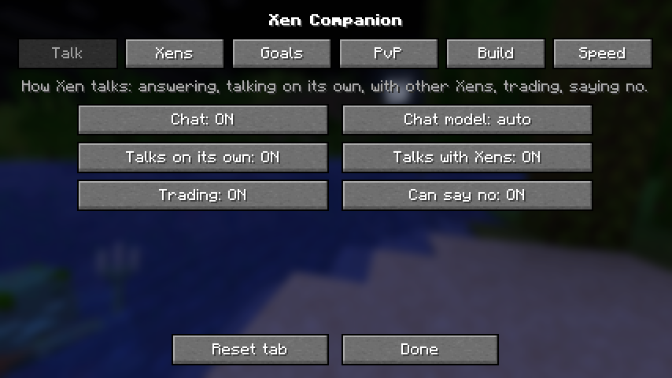

# Xen Companion (Fabric mod) 2.0.0-beta.26.1

Xen as a survival companion: a player that joins your world, learns, thinks,
feels fear and chats. Ask it for things in plain words ("Xen, get me some
wood", "build a NOT gate") and it does them, or tells you why it won't. It
makes its own tools, trades with villagers and bargains with you, has goals
of its own, and talks on its own and with other Xens. Every Xen has its own name,
skin and personality, and with evolution the ones that do well pass their
nature on. It plays fair: it only knows what it can sense, and it acts only
through a player's inputs. Since 1.1.0 main Xens think with **Xen 2.0**, a
learned mind that weighs what it wants against what it fears (below).

| file | Minecraft | Java | chat model |
|---|---|---|---|
| `xen-companion-2.0.0-beta.26.1+mc1.21.11-with-chat.jar` | 1.21.11 | 21 or newer | **inside** (all in one, about 400 MB) |
| `xen-companion-2.0.0-beta.26.1+mc26.x-with-chat.jar` | 26.1, 26.2, 26.3 | 25 or newer | **inside** (all in one, about 400 MB) |
| `xen-companion-2.0.0-beta.26.1+mc1.21.11.jar` | 1.21.11 | 21 or newer | downloads when needed (9 MB jar; best for phones) |
| `xen-companion-2.0.0-beta.26.1+mc26.x.jar` | 26.1, 26.2, 26.3 | 25 or newer | downloads when needed (9 MB jar) |

Use **one** of them. The **with-chat** jars are all in one: the mod, its brain
and its chat model (SmolLM2-360M), so Xen talks without downloading anything.
Get them from the GitHub **Releases** page (they're too big for this folder,
which has the light jars). This is a prototype, so expect rough edges.

**Every device**: the mod is plain Java with no native code, so the same jar
runs on x86-64 PCs and ARM64 (phones, Raspberry Pi, Apple Silicon Macs). The
chat model is plain Java too. Every change is checked on both an x86-64 and an
ARM64 machine (GitHub Actions: the tests, both builds, and the chat model).

How it all works inside (the networks, the training, the numbers) is in
`TECHNICAL.txt` on the Releases page.

## Xen 2.0: how it decides

Every few seconds a main Xen picks what to do next out of 22 things a player
does (get wood, get stone, craft, eat, build a house, farm, mine, smelt,
store, explore, trade, follow, help, guard, fight, flee, sleep, enchant, go on
an adventure...). It picks with **Xen 2.0**, three small neural networks:

* a **reward critic** that guesses how much good each choice will bring,
* a **fear critic** (like an amygdala) that guesses how much harm it risks:
  a careful Xen weighs that more, a brave one less,
* a **world model** that imagines a couple of steps ahead when it's unsure or
  afraid, before it commits.

It was trained from scratch over thousands of simulated lives with random
personalities. Since 1.5.0 it's **Xen 6.0**: Xen 5.2 (two trained versions merged into one
that dies less and gets iron and diamonds more often) trained on with its seven sins and its own plan as inputs. It **keeps learning in your world** on a background thread
(`<world>/xen/mind.bin`), so it doesn't slow the game. What it wants comes
from its nature: kindness, loyalty, power and money pull it different ways.
It only sees what a player could see. Minions keep the lighter classic brain
(DMM); set `brain` to `"dmm"` to use that for every Xen.

## Requirements

* **Fabric Loader** 0.16 or newer (tested with 0.19.5): <https://fabricmc.net/use/>
* **Fabric API** for your Minecraft version (tested: 0.141.6+1.21.11,
  0.155.3+26.1.2, 0.161.0+26.3): <https://modrinth.com/mod/fabric-api>
* **Mod Menu** (optional) for the settings screen: <https://modrinth.com/mod/modmenu>
* **Java**: 21 for Minecraft 1.21.11, 25 for 26.x.
* **Memory**: 2 GB is enough for Xen itself. For the chat model, give the game
  3 GB or more; it takes about 500 MB. With less, Xen still chats and
  understands requests, only more simply.
* **Chat model**: `smollm2-360m-instruct-q8_0.gguf`, about 390 MB. The
  with-chat jar has it inside: the first time it's needed, the mod unpacks it
  once into `config/xen/` (it's read from a file there, which saves memory).
  With the light jar it downloads by itself into `config/xen/`, or take it from
  the release page and put it there yourself. Either way the mod checks the
  file's SHA-256 and never loads a damaged copy. It takes a minute or two to
  warm up; until then Xen answers in plain words.

Players don't need the mod on a server: it runs on the server, and vanilla
clients can join and play with Xen. For single player, put it (with Fabric API)
in your `mods` folder and the built-in server runs it.

## Install

1. Install Fabric Loader for your Minecraft version.
2. Put `fabric-api-*.jar` and the matching `xen-companion-*.jar` in `mods/`
   (and Mod Menu if you want the settings screen).
3. Start the game. Make a world and type `/xen summon`.

## On a phone (Android)

Android launchers run the Java Edition with Fabric. PojavLauncher itself is no
longer updated; use its successors **Zalith Launcher 2** or **Amethyst**. Use
the **1.21.11** jar, which needs Java 21 (these launchers include it).

**Zalith Launcher 2:**

1. Install a new version: Minecraft **1.21.11** with **Fabric** (the launcher
   has a Fabric installer built in).
2. Open that version's **Mods** page, tap **Add mod** and pick
   `fabric-api-...jar`, then `xen-companion-2.0.0-beta.26.1+mc1.21.11.jar` (and Mod
   Menu if you like).
3. In the settings, give Minecraft as much memory as your phone allows (2 GB
   is fine; 3 GB or more if you want the chat model).
4. Play, make a world with cheats on if you want `/xen spawn`, and type
   `/xen summon`.

**PojavLauncher / Amethyst:** in the launcher, **Options → Launch mod installer**,
pick the Fabric installer jar (from fabricmc.net) and enter 1.21.11. Then copy
Fabric API and the Xen jar into the game folder's `mods` folder (in
PojavLauncher that's `games/PojavLauncher/.minecraft/mods` or
`/sdcard/games/.minecraft/mods`, depending on the version; turn on hidden
folders in your file manager). Pick the new Fabric version at the bottom of the
version list.

**On a phone:**

* Use the **light** jar, not `-with-chat`. On a phone the chat model is the **small** one (SmolLM2-135M, 145 MB,
  about 3x faster than the 360M one; it runs on the CPU), and it downloads by itself the first time (or put
  `SmolLM2-135M-Instruct-Q8_0.gguf` from the release in `config/xen/`). It needs about 1.1 GB of Minecraft's memory;
  with less, chat stays on its keyword rules (Xen still understands requests and answers in plain words). You
  choose: **AI chat (on this device)** auto/on/off and **AI chat size** auto/small/normal in the Talk tab.
* Slow phone? In Mod Menu (or `config/xen.json`) set **Decisions** to
  "2 a second" and turn **Learning** off.
* It was tested on PC servers, in a real (virtual) game client, and in the Java
  code on ARM64 machines, but not on a phone yet.

## How fast is it?

Measured on a 4-core cloud PC (x86-64):

* **Its brain**: a decision takes about 0.3 ms. A Xen decides 4 times a second
  (every tick in a fight). Learning (about 60 ms a step, one step every 4
  decisions) runs on its own thread, not the game's. With 8 Xens, a sped-up
  server still ran at 110-210 ticks per second (normal speed is 20). With
  **100 Xens** (`/xen spawn 100`), a tick took about 25 ms on average (the
  limit is 50), with a catch-up pause of several seconds about every 25
  seconds; 0.4.1 measured the same, so the new goals, trading, talking and
  watching cost little (under 3% of the server's time).
* **The chat model** (SmolLM2-360M, 8-bit, 360 million parameters):
  * loading takes 1-4 seconds; then it reads its two fixed prompts once (242
    and 367 tokens) at about 4, 7 or 9 tokens a second with 1, 2 or 3 threads,
    so it's ready after 1-2 minutes (until then Xen answers in plain words);
  * an answer reads about 50 new tokens (its notes and your message) and
    writes up to 40: 8 seconds with 3 threads, 10 with 2, 16 with 1;
  * `chatThreads` sets its threads (default: half your cores, 1-4). Its
    vocabulary is 49,152 tokens; the mod gives it a 1024-token window (the
    model can take 8192).
* **Phones** weren't measured. Their cores are slower: the brain is light
  enough, and the chat model stays off below about 3 GB anyway.

### The chat model on the graphics card

In single player (and on a LAN world you host) the chat model can run on your
graphics card: setting **Chat on GPU** (`gpu`), in the Talk tab. `auto`
(the default) uses it when there's a real graphics card with OpenGL 3.3;
`on` uses it even with a software renderer; `off` never does.

* **How**: Xen opens its own small hidden OpenGL 3.3 context, puts the model's
  weights there once (about 390 MB of graphics memory), and does the big
  matrix products with ordinary shaders (no compute shaders, so Macs and older
  cards work too). It reads the prompt 32 words at a time. The game's own
  rendering isn't touched, so it works the same with **vanilla, Sodium, Iris or
  a Vulkan renderer mod**: all it needs is a graphics driver with OpenGL 3.3
  (almost every PC and Mac). It uses the game's window library (GLFW up to
  26.2, SDL in 26.3).
* **When it can't** (no OpenGL 3.3, only a software renderer, not enough
  graphics memory, a dedicated server, or anything else going wrong), it says
  why in the log and the model stays on the CPU. `/xen settings` shows where
  it runs.
* **How fast**: measured here only on Mesa's software renderer (no graphics
  card in the test machine): reading a 285-token prompt took 39-42 s on it
  against 73-79 s on the CPU path, so a real graphics card should be a lot
  faster. Both give the same next word; the numbers differ a little
  (at most 0.53 of about 19) because the CPU path rounds its inputs to 8 bits.
  Checked in real 1.21.11 and 26.1.2 clients. The 26.3 path (SDL) couldn't be
  tried here: 26.3 itself wouldn't open a window on the test machine.
* **Phones**: PojavLauncher's usual renderer (GL4ES) has no OpenGL 3.3, so it
  stays on the CPU; a renderer with OpenGL 3.3 or newer (on Zink/Vulkan) may
  work, but it's untested.

## Talking to Xen: it understands and does it

Say its name in chat. Only its owner can give it orders (anyone can, for the
ownerless Xens from `/xen spawn`). Anyone can chat with it.

| you say (any words like these) | Xen |
|---|---|
| "Pip, follow me" / "come here" / "let's go" (typos like "fallow me" work, and Thai: "ตามมา") | follows you (to about 4 blocks), and does things of its own nearby while you're close |
| "Pip, stay" / "wait here" | stays around here |
| "Pip, go explore" / "do your thing" | lives its own life |
| "Pip, get me 5 logs" / "chop some trees" | walks to a tree it knows, chops, climbs a block if it must |
| "Pip, get stone" / "find coal" / "find iron" / "go mining" | the same for stone, coal, iron or any ore |
| "Pip, kill a pig" / "get us food" | hunts an animal it sees and picks up the meat |
| "Pip, give me your wood" / "hand over 12 cobblestone" | walks over and tosses it to you (keeps its tools) |
| "Pip, craft a boat" / "make me 4 torches" / "craft a chest" / "make me a stone pickaxe" | crafts it with the recipe book (planks and sticks first, a crafting table if needed), or says what's missing |
| "Pip, build a shelter" / "hide!" | digs into a hill, builds a little hut with room inside (about 28 blocks, on a flat spot close by) or digs a hole and covers it, and stays in until morning |
| "Pip, get in my boat" / "hop on" / "ride with me" / "get on the horse" / "tame that horse" | gets in your boat (or one it sees), gets on a horse (a wild one bucks until it's tamed; with a saddle it rides after you) |
| "Pip, get out" / "get off" | gets out of the boat, off the horse |
| "Pip, light the tnt" / "burn that" / "use the flint and steel" / "bone meal that" / "put that out" | uses the item on the block you're looking at (or TNT it can see), and runs from lit TNT |
| "Pip, build a NOT gate" / "an OR gate" / "an AND gate" / "a long wire" | builds that redstone circuit from parts it carries |
| "Pip, eat something" | eats, if it has food and is hungry |
| "Pip, stop" / "cancel that" | stops what it's doing |
| "Pip, trade with the villager" | walks up to a villager, opens its trades and takes the good ones ([trading](#trading-villagers-and-you)) |
| "Pip, how much for your logs?" / "I'll give you 2 iron for 16 logs" | names a price, bargains, and trades with you |
| "Pip, what are you doing?" / "how are you?" / "what's your dream?" / "what do you have?" / "who are you?" | answers straight from what it knows (no chat model, so nothing made up) |
| "Pip, what do you see?" / "thanks!" | just talks |
| "dax come here" (the first 3 letters of its name are enough) | answers from any distance |
| "I'm hungry" / "can I have some bread?" / "I need a pickaxe" | shares if it can spare it (a kind one more readily) |
| "Pip, join my team" / "let's be a team" | joins your team if it likes you enough (Xens also pick teams by who they talk to and live near) |
| "new rule: no fighting" / "from now on everyone works" | the village votes on it; passed rules are kept, broken ones punished |
| "Pip, build a highway north" / "build an obsidian road east 200" | a tunnel highway in that direction ([more](#building)) |
| "Pip, build a modern house" / "a house on stilts" / "a tower" / "a cottage" | builds its own design in that style |
| "Pip, build a place" / "set up your own place" / "build a homestead" | pictures a whole place first (its house, its own pool, sitting area, road, paths and wall, in the style it learned), shows it, then builds it ([more](#a-whole-place-of-its-own-pictured-first-2000-beta19)) |
| "Pip, decorate your house" / "upgrade your house" / "make your house nicer" | takes its house a [stage](#building) further (basic, simple, good, perfect) |
| "Pip, help Aria build" / "help them build" | joins a friend's build: the same plan, and every block either of them puts down counts for both |
| "Pip, where's the nearest village?" / "have you seen a stronghold?" / "what places do you know?" | where it saw one (coordinates, the biome, how far and which way) |
| "Pip, what biome is this?" | the biome it's in |
| "Pip, what happened on the server?" / "tell me the lore" | the latest of the world's story (a chronicler tells it; others send you to one) |
| "yes" / "no" (no name needed) | answers a question it just asked you, or its trade offer |
| "Pip, watch this!" / "watch me" / "copy me" | keeps its eyes on you for a minute, to [learn from you](#learning-by-watching) |

How it understands: clear keywords decide first. When there are none ("go see
what's out there"), the chat model picks one of the things above, and only if
it's clearly more likely than just talking. Questions and thanks are always
just talk. `/xen status` shows what it's doing right now.

It does it fairly:

* It only goes for blocks and animals it knows about: felt within 6 blocks
  (but not ore buried in stone: nobody can tell that's there), spotted within
  14 (a trunk between the trees, ore showing in a cliff: only what shows a face
  to the air), or seen further away in its 90° view. In the dark it can't make
  out anything unlit beyond 5 blocks, like a player. When it
  knows of none, it looks around and walks somewhere new. Huge mushrooms aren't
  trees to it (their stems give no wood).
* It mines what it can see and reach, like a player: from the side, diagonally,
  up the trunk, clearing leaves in the way. Then it picks up what dropped.
* It walks there itself, finding a way through the blocks it knows (up steps,
  down drops, around obstacles and lava), and digs only when there's no way.
  With good health it drops down 4 or 5 blocks (a little fall damage, like a
  player); when it's hurt, 3 at most. In a hole it digs a staircase out.
* It mines with the real break time and the best tool it has, places only
  blocks and parts it carries, hits with the normal reach and cooldown, and
  gives items by tossing them.
* It answers honestly. For a request it says what it will do, or exactly why
  it can't ("I need 10 dirt or cobblestone and have 3", "the ground isn't
  flat", "I need 2 more redstone"). In conversation, anything it claims must
  be in its own notes. It can't promise things, and it never writes commands.
* It needs the right tools, like you: stone and coal need a pickaxe, iron a
  stone one. Ask for stone without one and it gets wood first, makes the
  pickaxe, then gets the stone.

## Around people

* **Talking without its name**: it knows you're talking to it when you're in a
  conversation with it (it answered you in the last half minute), when you're
  looking right at it, or when it's your Xen and nobody else is around.
* **Remembering**: "Pip, remember that the base is by the big oak". Then "what
  did I tell you?" or "where is the base?". It's saved with the Xen (up to 12
  things); "forget what I told you" clears yours.
* **Signs**: it reads the signs it can see, says what a new one says when
  someone's there, and knows it afterwards.
* **Greetings**: crouch at it quickly a few times and it crouches back two to four
  times (you see it crouch, like a player) and trusts you a little more (never
  fully: anyone can crouch).
* **Pokes and attacks**: only one light tap with an empty hand while you're
  talking with it is a poke ("Hey! What's up?"). Anything else is an attack: a
  weapon, a critical hit (hitting while falling), a crouching hit, a hard hit,
  a second hit within three seconds, or a hit out of nowhere. It reads how you
  hit it at that very moment. Its owner gets told off, worse each time ("Ow!
  What was that for?", "Stop it!", "I'm not fighting you. Stop!"); a wrathful
  one hits back for a few seconds, a gentle one keeps away. With PvP `own` (the
  default) it decides what to do about anyone else's attack itself: it fights
  back against armed attacks on it or its owner, lets a friend's mistake go,
  and gets away when it's losing.
* **Boats and horses**: following you, it hops into your boat when there's room
  and gets out when you do; with no seat, it puts its own boat on the water,
  paddles after you and takes the boat back at the shore. A wild horse throws it
  off a few times before it's tamed; with a saddle it rides after you.
* **Giving**: it thinks for a moment, keeps what it needs (wood for its
  pickaxe, stone for its tools, 24 blocks for a hut in the evening, a little
  food when it's hungry) and says so, then tosses the rest at your feet and waits
  while you pick it up.
* **In the dark** (caves, tunnels, under a roof) it puts torches on the floor or
  the walls as it goes, and makes torches from coal when it has none.

## Tools: it crafts like a new player

Xen makes its own tools the way a new player does: logs into planks, planks
into sticks and a crafting table, then a wooden pickaxe (three logs are
enough), and with cobblestone a stone pickaxe, a stone sword and a stone axe.
It crafts with the recipe book, like you: it clicks the recipe (which puts the
ingredients in the grid), shift-clicks the result, and puts back what's left.
Small things in its own 2x2 grid; tools at a crafting table it places next to
itself (or one that's already there), opened with a right-click. One step at a
time, so it takes a few seconds. It can't smelt yet, so iron tools are out of
reach for now.

## It acts like a player, not a digging machine

* **It only mines what's worth it**: wood, ore its pickaxe can mine, stone when
  it needs blocks. It never digs straight down under itself (it digs a
  staircase instead, and stops if lava or water is under the next step).
* **Next to you, it doesn't just stand there**: while you're within about 12
  blocks it gets on with what it needs (wood, stone, food, ore, a shelter at
  night: "I'll grab some wood while we're here.") and drops it to keep up when
  you're more than 24 blocks away ("Coming!"). Otherwise it watches you or
  looks around. Only a free Xen goes exploring on its own.
* **It swings only at something hostile in front of it**, never at the air.
* **It knows how mobs behave**: endermen, piglins, wolves, bees and the like
  leave you alone unless you provoke them, so it doesn't; spiders are calm in
  daylight; a mob that's after it or its owner is fought. It never hits
  villagers, golems or pets, and hunts only cows, pigs, sheep, chickens and
  rabbits (never a named one or one on a lead).
* **Creepers**: when one hisses close by, it turns and sprints away (about 4
  blocks in the 1.5 seconds before the blast, in tests). After hitting one, it
  always steps back.

## Learning by watching

Xen watches the players it can see and copies moves that **work out** for
them, clumsily at first and better each time it sees one done well (and each
time it pulls it off itself). Say "Pip, watch this!" first, so it keeps its
eyes on you.

* **The water clutch (MLG).** Jump from high up with a water bucket and empty
  it just before you land. If you land in the water unhurt, Xen saw it work:
  "Whoa, Steve, a water clutch! I want to learn that." From then on, when it
  falls with a water bucket, it looks down and uses it before it hits the
  ground, then scoops the water back up. How late it starts clicking depends
  on its skill, so at first it's often too late ("Too late! I'll get it next
  time.").
* **Your fighting style.** When you win a fight in front of it, how you fought
  (crits on the way down, full-charge swings, S-taps, jump resets, spacing,
  the shield) pulls its [fight genes](#teams-and-pvp) your way, more for a
  clean win: "Nice fight, Steve! I'll crit more, on the way down, like you."

It learns only from what it could see you do (your moves, what you hold, a mob
flinching), never from anything hidden, and it keeps what it learned.
`/xen status` shows it. Setting: **Learns by watching** (`copy`).

## Trading: villagers and you

**Villagers.** "Pip, trade with the villager" (or on its own, when it wants
to): it walks up, right-clicks the villager, reads the offers on the trading
screen, and takes the ones that are good for it, with the same clicks a
player makes. It knows about what things are worth (an emerald is about 15
coal or 5 bread) and what they're worth to *it* right now (food when it's
hungry, a tool it lacks, what its dream needs, less for what it has plenty
of). From a test on a real server:

```
<Steve> Clover, go trade with the villager
<Clover> Okay! I'll trade with the farmer 2 blocks away.
<Clover> I traded with the farmer: gave 30 coal and got 6 bread, 1 emerald.
```

**You.** Make it an offer, ask its price, or say yes or no to its offer. It
takes a fair deal, answers a poor one with a counter-offer (a bit high first,
then halfway, then its last offer), walks away from a bad one, gives friends a
better price, and never trades away what it needs. With someone it trusts, it
hands over its part first; otherwise it waits for yours (toss it over).

```
<Steve> Clover, how much for your logs?
<Clover> I'd trade 16 logs for 3 emeralds. Deal?
<Steve> Clover, i'll give you 2 iron for 16 logs
<Clover> Let's meet halfway: 16 logs for 6 iron?
<Steve> ok deal
<Clover> Deal! I trust you, so here are the 16 logs first. Toss me the 6 iron.
<Clover> Here you go!
<Clover> Thanks! Nice doing business with you.
```

**Trust.** Every Xen remembers how much it trusts each player and Xen it has
met: kind words, fair deals and chats make it trust them more; hitting it,
or taking its part of a deal and never paying, makes it trust them less. It
won't trade with someone who hurt it. Setting: **Trading** (`trading`).

## Saying no

Xen can refuse, and it says why:

* someone who hurt it: "No, I won't, because Alex hurt me." (no matter what;
  an ownerless Xen takes requests from anyone, an owned one only from its
  owner, and nobody who hurt it gets a trade);
* badly hurt: "No, not now: I'm badly hurt and need to heal first.";
* a timid Xen asked to explore in the dark: "No, I won't go exploring now,
  because it's dark and I'm scared.";
* asked for what it needs: its food when it's hungry, the blocks for its home,
  its emeralds when it dreams of trading ("No, I won't give my cobblestone
  away, because I need them for my home.");
* an ownerless Xen asked for its things by a stranger.

Saying **please** (or "I insist") changes its mind, except when you hurt it.
Only its owner can give it orders at all. Setting: **Can say no** (`refuse`).

## Redstone (small circuits)

Xen builds the circuits it worked out itself in its redstone lessons
(`xen/redstone`): a NOT gate (5 parts), an OR gate (7), an AND gate (22) and a
long wire with repeaters (20). It needs the parts in its bag (redstone dust,
redstone torches, repeaters, levers, lamps, and dirt or cobblestone for the
blocks), and flat, clear ground in front of it. It places every part by hand,
facing the right way, and sets the repeaters' delays. Tested in the game: the
NOT gate lights the lamp with the lever off and turns it off with the lever
on. **Biggest circuit** (24 parts by default) keeps anything big enough to
slow a server away. Turn **Redstone** off to disable it.

## Names, personalities and skins

* **Names**: by default (`accurate`) a Xen you summon by a real account's name
  (`/xen summon jeb_`), or one listed in `config/xen/real_names.txt`, is that
  account, with its real skin, like the Carpet mod. Other new Xens get **names
  like real players have now** (luvhi, MeeroSG, cold_lemon, Brushriver851,
  xKairox), made up here, never copied from anyone's account. Or names that fit their nature, in the
  **Name style** (`nameStyle`) you like: `fun` (a silly Xen may be WobblyNoodle or LilPickle,
  a bold one IronComet, a grumpy one SaltyBadger), `gamer` (Pickle_42,
  xXWaffleXx, TheSneakyGoose), `fantasy` (Zorbax, Lumika), `classic` (Pip,
  Nova, Bramble) or `mixed` (all of them). Xen, Xen2... with **Random names**
  off. `/xen summon <name>` picks the name, and
  summoning the same name again brings back the same Xen with its nature,
  skin and things.
* **Personality**: every Xen is braver or more timid (how much fear holds it
  back), more or less curious (how often it tries new things), chatty or quiet,
  patient or impatient (how long it keeps at a chore), and has a tone of voice
  (cheerful, calm, grumpy, shy, bold, silly) that shows in what it says.
  `/xen status` and the summon message tell you who it is: "Rune (shy, timid
  and impatient; a skirmisher (hits and steps back), builds stone forts)".
* **Fighting**: every Xen has ten fight genes, the 1.9+ PvP skills a player
  learns (see [PvP](#teams-and-pvp)). They start from one of five styles and
  are inherited:
  * `brawler`: trades blows and jumps for critical hits a lot;
  * `rusher`: rushes in, keeps pressing, and jumps for criticals most;
  * `skirmisher`: hits, then steps back while its sword recharges, and backs
    off to heal when badly hurt;
  * `guard`: holds its ground behind its shield (give it one), waits for
    full-power swings and lets the foe swing first;
  * `dancer`: circles around its foe between swings.
* **Building style** (random, and inherited): the shelter it builds when you
  ask, a `hut` (2-high walls and a roof, 10 blocks), a `fort` (corners filled
  in, 18 blocks) or a `tower` (3-high walls, 14 blocks), in its favorite
  material: `stone` (cobblestone), `earth` (dirt) or `any`. With too few blocks
  for its style, it builds a hut.
* **Set them yourself**: `/xen style Pip fight guard` (also `build`,
  `material`, `tone`; `bravery`, `curiosity`, `chattiness`, `diligence` from 0
  to 1; and each fight gene: `crit`, `charge`, `spacing`, `wtap`,
  `jumpreset`, `strafe`, `counter`, `select`, `retreat`, `shield`). Its owner
  or an operator can do it, and it's saved with the world.
* **Skins** (`skins`, any mix of these):
  * `modern` (the default): 48 skins in today's style: shaded hair with
    volume, hoodies with drawstrings, jackets, sweaters, cargo trousers and
    sneakers, muted and pastel colours, many with slim arms
    ([see them](../docs/skins-modern/preview.png); original, free to use, CC0);
  * `fun`: the funny 61 of earlier versions ([see them](../docs/skins/README.md));
    `pack`: both. All of them are signed, so everyone sees them, with or without the mod;
  * `random`: both packs and Minecraft's 18;
  * `default`: Minecraft's 18 (Steve, Alex, Ari, Efe, Kai, Makena, Noor, Sunny,
    Zuri, in both arm widths);
  * `folder`: **your own skins**. Put PNG skin files in `config/xen/skins/`
    (download them from NameMC, Planet Minecraft, The Skindex, or draw your
    own). Each one is uploaded once to mineskin.org (unlisted), which signs it,
    and remembered in `config/xen/skins/signed.json`, so every player sees it;
  * `mineskin`: random skins from mineskin.org's public gallery (online);
  * `player:Name`: a Minecraft account's skin (`/xen set skins player:Dream`);
  * one skin by name (`steve`, `alex:slim`) or `texture:<value>:<signature>`.
* **Antics** (`antics`): Xens do unpredictable things for fun. Crouch up and
  down next to one and it dances along (Xens nearby join in); now and then it
  shows off a trick ("Watch this!": a sprint, a jump and a spin) that doesn't
  always work ("I meant to do that."); in a fight it may take a snack break in
  front of a foe that's nearly beaten, taunt it, or fake a retreat. Standing
  about with nothing to do for a while, it fidgets like a bored player: a
  jiggle side to side (often crouching, at you), a hop, a few crouches, a look
  all around, punching the air, flicking through its hotbar, a spin. Silly and
  cheerful Xens do it most, grumpy ones least; never in danger.

## Experimental: custom instructions and your own script

Both are in the settings screen's **Experimental** category (or `/xen set
instructions ...` and `/xen set script ...`).

**Custom instructions** tell Xens who they are and what they should know:

```
You love cats and hate the rain. You're scared of the dark.
Pip: you're a pirate and talk like one.
```

A line that starts with a Xen's name and a colon is only for that Xen. The chat
model reads them when it answers and talks. Without the chat model, Xen still
answers from them: "Pip, do you like cats?" "I love cats." "who are you?" ends
with "I'm a pirate and talk like one."

**Custom script**: your own rules, one per line, `when <something>: <what to do>`:

```
when night: do build a shelter
when morning: say Good morning, {player}!
when someone comes: wave
when hears hello: dance
when sees creeper: say RUN!
when hungry: say I'm starving!
when every 10 minutes: show off
# a note
```

| when | |
|---|---|
| `night`, `morning`, `rain` | it gets dark, light, or starts raining |
| `hungry`, `hurt`, `attacked`, `diamonds` | its hunger gets low, its health gets low, something hits it, it gets diamonds |
| `someone comes` | a player it knows comes within 12 blocks |
| `sees <a mob>` | it sees one (`sees creeper`, `sees cow`) |
| `hears <a word>` | someone within 16 blocks says it |
| `every <N> minutes` | now and then |

| do | |
|---|---|
| `say <words>` | says it (`{player}` is the player it's about, `{name}` its own name) |
| `do <a request>` | anything you could ask it (`do build a shelter`, `do get 5 wood`, `do follow me`), as if its owner asked, so it can still say no |
| `dance`, `spin`, `wave`, `show off` | antics |

Each rule runs at most once a minute. The script box shows which lines it
can't read. With `/xen set script`, put `|` between rules.

## Teams and PvP

* **Teams**: `auto` (default, like an SMP): Xens start and join their own
  teams (the Iron Wolves, the Night Owls...) and their names take the team's
  color; anyone not on their team is a rival they may fight (near their base,
  fighters looking for a duel, bullies), and "1v1 me" starts a duel. Or all
  Xens on one team, or split into 2-6 colored teams (red, blue, green, yellow,
  purple, aqua): Xens choose and change teams on their own, by who they talk to
  and live near. Teammates can hit each other too
  (`friendlyFire`, on by default): a friend's hit is forgiven, a bully's isn't.
* **Hidden nature**: each Xen is secretly aggressive, passive or friendly, and
  trusts each person differently. An aggressive one may pick a fight with
  someone weaker; a passive one walks away; a friendly one makes up.
* **PvP**:
  * `own` (default): its own call. It fights back when a player attacks it
    or its owner with a weapon, lets a friend's mistake go (someone it trusts,
    while it's healthy), and gets away instead when it's losing. A poke with an
    empty hand only gets its attention.
  * `off`: Xen fights only monsters.
  * `defend`: it always fights back against a player who attacks it or its
    owner with a weapon (or keeps poking it). It never fights its owner or a
    teammate, and it draws its sword when an armed stranger comes close.
  * `teams`: Xens of different teams also fight each other.
* **How it fights**: like a 1.9+ player, with only a player's inputs, and by
  the server's own rules:
  * **critical hits**: it jumps and strikes on the way down, and lets go of
    sprint in the air (a crit doesn't count while sprinting);
  * **full-charge swings**: crits and extra knockback need the swing charged
    over 90%, so it times its swings;
  * **sprint hits and S-taps**: it sprints in for extra knockback, then steps
    back a moment so the next hit is a sprint hit again;
  * **jump resets**: it jumps toward a hit as it lands, for less knockback;
  * **spacing**: it keeps near the edge of its reach while its sword recharges;
  * **reading the foe**: it steps back when the foe jumps in for a crit, and
    can wait for the foe to swing first and punish it (hit selecting);
  * **shields**: it raises its shield while recharging, takes out its axe
    against a raised shield (an axe hit disables it) or circles around it;
  * **healing**: badly hurt, it backs off and eats a golden apple.
  It fights back at once when hit, even from behind (it knows everything
  within 6 blocks). How much of each it does is up to its fight genes.
* **How good is it?** Against a simple scripted fighter with the same iron
  sword that strikes first, a brawler Xen now wins about half its fights (6 of
  10) and a rusher 2 of 5, where the last version won none. A good player will
  still beat it: it can't combo or dodge arrows, and doesn't use a mace,
  spear, crystals or pearls yet.

## The PvP arena: red against blue

Xens can train their fighting against each other:

```
/xen arena start [xens per team] [generations] [kit]     (operators; e.g. /xen arena start 4 40 sword)
/tick sprint 1d                                          (optional: much faster)
/xen arena status
/xen arena stop
```

* It builds lanes high above you (barrier blocks with colored glass under the
  floor, so nothing spawns there and nothing gets broken). Red Xens `Red1`...
  and blue Xens `Blue1`... join, all with the same kit: iron armor, an iron
  sword and a golden apple (`shield` adds a shield, `axe` a shield and an axe).
* Every round each red Xen duels a random blue one in its own lane, until one
  falls (or 30 seconds). The teams swap ends every round, and nobody gets to act
  first.
* Every 3 rounds each team evolves: its worst quarter get the fight genes of
  children of its best (each gene from one of two parents, plus a small
  mutation). A team that wins under a quarter of its fights also learns from
  the enemy (one child gets a parent from the other team).
* Every generation is logged in `<world>/xen/arena.csv`. The best fighters'
  genes are kept in `arena_champions.json`, and **new Xens are born with
  them** (a little mutated). Arena Xens don't learn into the shared brain, so
  duels can't crowd out what it knows about lava and caves.

A 40-generation run (4 against 4, sword kit, about 8 minutes sprinted):
both teams ended up fighting the same way: always jump for critical hits,
swing as soon as the sword allows, fight near the edge of reach, S-tap and
jump-reset a lot, and never wait for the foe to swing or back off. Blue started
as circling dancers and lost 11 of 12 fights at generation 20; learning from
red, it caught up and was even (6-6) by generation 31.

How good is the champion it evolved? Against each of the five starting styles,
3 fights from each side (30 fights, arena kit), it won 15, lost 12 and drew 3.
It beat the careful styles (dancer 5-0, skirmisher 4-1, guard 3-2) but not the
aggressive ones (brawler 2-4, rusher 1-5). What the arena evolved is itself an
aggressive fighter, so self-play confirmed what works best with these ten
skills, but it hasn't yet found anything better than the best hand-made
style.

## Evolution

With **Evolution** on, every few days (default 3) the Xens without an owner are
ranked by how they did: what they gathered, how long they lived, how often
they died. The worst quarter leave, and children of the best half take their
places. Each gene (bravery, curiosity, chattiness, patience, tone) comes from
one of two parents, with a small mutation. All Xens keep sharing one brain
(what they learned). What evolves is their nature. Each generation is logged
in `<world>/xen/evolution.csv`. Your own Xens (with an owner) are never
replaced.

## Its goals: now, soon, and its dream

Every Xen has goals in three tiers (`/xen status` shows all three, and when you
chat with it, it knows them):

* **Instant** (seconds): staying alive and what it's doing this moment:
  swimming up for air, eating, fighting, getting away from a creeper, making a
  tool, keeping up with you.
* **Short** (minutes), when it's free (nobody to follow, nothing asked of it):
  find food, build a shelter for the night, get wood, get stone, look for ore,
  trade with a villager, or explore. It weighs what it needs right now (hungry
  with no food? dark with no roof? no pickaxe?), its personality (patient Xens
  like work, brave ones go for ore, curious ones explore), how well each goal
  has turned out for it before (it learns which it likes), and what its dream
  needs.
* **Long** (days): its dream, picked from its personality: build a home, a big
  stockpile of wood and stone, find diamonds, become a trader with 5
  emeralds, see places 300 blocks away, or make three friends. The dream
  steers its short goals (a Xen dreaming of a home gathers blocks, then builds
  a fort in daylight and remembers where it is). When a dream comes true, it's
  proud of it, says so, and picks a new one. Dreams are kept with the Xen.

Your requests always come first. Turn short goals off with **Own goals**
(`wants`).

## A whole place of its own, pictured first (2.0.0-beta.19)

Ask "Pip, build a place" (or "set up your own place", "build a homestead", "lay out a compound"), or let a Xen decide
on its own (when it builds its home, it sometimes lays out a whole place instead, more in creative and the more it
likes what goes in one). There's no template, and nothing round the house is a copy: it pictures the place first,
then builds it.

* **It looks over the ground** round it (about 45 x 45 blocks), the way you would before building: the lie of the
  land, water, trees, anything someone built, and what it can't see from where it stands. It never builds on someone's
  build, in water, or where a player is standing.
* **It pictures it in its head:** where its house goes and which way it faces, where its pool and a sitting area go,
  a road out from its door with paths off it to each part, and a wall round it all with a gate where the road goes
  through. It tries thousands of ways in a moment and keeps the one it likes best. What it likes is its own: flat
  ground, no trees in the way, the door facing the way in (toward you) with open ground in front, a pool close but not
  in front of the door, a road that doesn't climb, the parts lined up (a tidy Xen) or not, close together or spread
  out, a straight road or a winding one. Which parts it wants is its own taste too (silly and cheerful Xens like a
  pool, fort builders a wall, chatty ones a sitting area, careful ones lamps), and it learns from what you say about
  the place ("nice place!", "that's ugly").
* **Its own, in a style it learned:** from what it was shown (the road, the walls, the pool, the outdoor decorations)
  it learned what things are made of (the road of andesite, a wall of andesite with polished andesite posts and a slab
  on top, a pool rimmed with glazed terracotta, a lantern on a fence post, stairs for chairs, a carpet or plate for a
  table top, moss or leaves for a bush; for each kind of place: spruce in the snow), and it makes its own to fit the
  ground there:
  * **the road** goes in the ground, not on it: the grass dug out and the road laid in its place, the bumps mined down
    and the dips filled, a slab where it climbs (no jumping), room cleared above it, three wide in creative, lamps
    along it if it likes them, and on out past the gate. Paths go off it to the pool and the sitting area. In survival,
    a path made with a shovel.
  * **the pool** is dug into the ground, the size it likes and has room for: a rim all round, water two deep (a few
    buckets by the rim, and the rest fills itself, as water does).
  * **the sitting area:** the ground levelled, a table with a chair either side, a lamp.
  * **the wall** follows the land all round, two high and capped, a post with a light every few blocks and at the
    corners, and two tall posts at the gate.
  * **a garden**, if it likes one: bushes either side of the way to its door, and trees of its own about the place,
    shaped like the tree it was shown (its trunk, how its leaves narrow going up) but never the same twice.
* **The house** is one it was shown (its own version: its wood, maybe mirrored) or one of its own designs (its taste
  decides). Its furniture goes in when the house is done.
* **You can see what it pictured:** outlines in the world, each part in its colour (gold the house, cyan the pool,
  pink the sitting area), the road and paths dotted white, the wall grey, the gate purple and the door red, while it
  pictures it (it looks at where each part goes) and for a minute after. `/xen layout` shows it again (and says what's
  in it). Its journal has a map of it (H house, D door, # road, + path, P pool, S sitting area, W wall, G gate).
* It builds it part by part, the house first (then its furniture, the road, the pool, the sitting area, the bushes,
  the wall), and says when the whole place is done. In survival it's of what it can make (cobblestone for the stone,
  a torch for a light) and it wants a wall less.

## What Xens were shown (2.0.0-beta.17, more in 2.0.0-beta.19)

Xens were trained on what was marked with the Build Axe: houses (two houses, a big house, a 2 story house, a snowy
house, a desert house), other builds (a desert blacksmith, a jungle temple, a pillager outpost, two wells, a farm, a
cage), furniture (two couches, a counter, a table, a bar, a hanging light), things round a house (a pool, a road, a
path, an entrance, a wall with outdoor decorations, a glass wall, a staircase), a tree, and caves (cave entrances, the
inside of a cave, ravines, a frozen river) with a plains river. Every Xen knows them:

* Ask for one by name: "build a pool", "build the bar", "make a couch", "build a 2 story house", "build a well".
* The houses are among the houses a Xen may build on its own (when it likes copying what it has seen). In a whole place
  of its own it takes one shown where it is first (the snowy house in the snow, the desert house in the desert).
* When a Xen finishes a house, it puts in a piece of that furniture if one fits inside (in survival, if it has most
  of the blocks).
* It builds its own version, not a copy: in its own wood (the wood it has, or in creative the wood it likes), and at
  some places the other way round (mirrored, left for right). The same place always gets the same version, so a house
  it comes back to finish is the same house.
* From all of it, it learned a style for each kind of place (what roads, walls, pools and lamps are made of; in the
  desert what the buildings there are made of) and a tree's shape (the spruce's trunk and how its leaves narrow): for
  the places it lays out itself.
* The caves and the river aren't for building: they're for seeing. From them it learned to tell what it's looking at
  (a cave entrance, the inside of a cave, a ravine, a river, a frozen river): every few seconds it takes in the spot
  its eyes are on (the 9 x 9 ground there: water, ice, sand or rock on top, the hollow under it, how steeply it drops),
  names it if it's one of those, remembers it in its places ("the ravine", "the river 2") and its journal, and now and
  then says so. On what it was shown it names caves, rivers and frozen rivers right 95 to 100 times in 100, cave
  entrances and ravines about half the time; anything else is just ground to it.
* From the caves it also learned what a big cave is like (how much room, nearly all rock round it, a rock roof within
  19): a cave like those it goes to first for ore. Smaller caves it still notices as before.

The ground they were marked on (the grass and dirt under them) isn't part of them: they go on the ground where
they're built. A house marked a block too high (the door's lower half left out) gets its bottom row back.

## Build Axe: training data (2.0.0-beta.14, its screen 2.0.0-beta.15, the box in the world 2.0.0-beta.18)

A developer's tool, cheats only. `/xen BuildAxe` gives an enchanted wooden axe:

* **Hit** a block: one corner of the box. Hit another: the other corner, and a screen comes up. With Xen in your game
  too, the axe reaches 160 blocks: aim at a block far off and click (the box can be marked from outside it).
* **Right-click** a block: leave it out (it's saved as air: the grass round a tree, a torch you placed). Right-click it
  again to put it back. **Crouch and right-click**: leave out every block of that kind in the box.
* **Right-click the air**: the screen again.
* **See the box** while you hold the axe: its edges in gold dust (seen from far off), the blocks you left out marked
  in red, and its size above the hotbar ("12 x 6 x 9, left out: 3"). With one corner hit, a cyan box goes from it to
  the block you're looking at, with its size, so you see how big it will be before the second hit. Red: too big.

The screen shows the box's size and what's left out, its type (tap Build, Tree or Cave, or type your own: house, farm,
bridge...), its name (a must), and Save or Cancel. (With Xen only on the server and not in your game, there's no
screen: `/xen BuildAxe type <your type>`, then `/xen BuildAxe save <name>`.) Each type has its own file,
`config/xen/buildaxe/<type>.jsonl`, one line per thing you save: its type and name, the dimension and biome, its size,
a palette of the blocks in it (with their states) and one palette index per block (air too), how many you left out,
and how dark it is and how far under the surface. Up to 256 blocks a side and 4,194,304 blocks in all (256 x 64 x
256: a village). The axe never breaks or strips anything, and
nothing about you or where it was is kept. Xens don't learn from it in the game: it's data for training them.

## Picking up what it mined, fidgeting (2.0.0-beta.18)

Whatever a Xen mines, it walks over and picks up (when there's room in its bag): the cobblestone and dirt from
digging too, not only ore and wood. After chopping a tree it keeps an eye on it for a few minutes and picks up the
saplings, sticks and apples its leaves drop. Standing about with nothing to do, it fidgets (see Antics).

## Mining like a player (2.0.0-beta.13)

Going down, a Xen digs a staircase (or takes a cave it has seen), not a shaft straight down, and it never digs out the
block someone is standing on. It walks over to what it mines and picks it up right away. Its way finding only knows
what the Xen could know: out under the sky the lay of the land, under the ground only what it has seen, what's right
by it and the way it came (no seeing a lit cave through rock). More of what Xens say is now put in their own words
(no typed emotes like *crouch*).

## Whispers, unfinished houses (2.0.0-beta.12)

Xens whisper with the game's own `/msg` (only the one it's for sees it): `/msg` a Xen and it whispers back; plot
warnings and some gossip are whispered. Chats between Xens last as long as they have something to say. A Xen that
stopped building its house goes back and finishes it when asked for a house again nearby.

## Hardcore, who Xen is, village houses (2.0.0-beta.11)

**Hardcore** (Basics page, `/xen set hardcore auto|on|off`): one life each. A hardcore Xen that dies is gone for good:
it doesn't come back, nothing of it is kept, and the Xens that knew it remember it. It minds danger more, backs off
sooner, and won't go off on a risky errand while hurt, however nicely it's asked. `auto` (the default) follows the
world: hardcore in a hardcore world.

**Who Xen is**: to the chat model, a player living in this world, who knows only what it has seen, remembers or was
told, with goals, friends and fears of its own. A reply that talks about itself as an AI, a bot or a program is thrown
away.

**Village houses**: a Xen that comes to a village looks at its houses (their style rubs off on its designs) and may
build a copy of one, out of what it has; "build a village house" asks for one. They're read from the game's own
structure files in your game, so nothing of Mojang's is in Xen.

**The End**: it counts what its arrows at the flying dragon do and waits for her to land when they miss, waits out her
breath, backs off to heal when low, uses a bed by the End portal before jumping in, and mines end stone for towers and
bridges when it's short. It turns its head like a person (fitted to recorded play), and learns where ore is by
watching you mine it.

## The End, from a recorded fight (2.0.0-beta.10)

A Xen hits the perched dragon from the side (never under her head, where her wings fling you as she takes off),
glances at her instead of staring, and keeps its eyes off endermen. Flung high, it throws an ender pearl at the ground
(a pearl clutch); off an edge, it throws one back onto the land it came off.

## Bored, trusting, and a map in its head (2.0.0-beta.9)

A bored Xen does something nobody needs: it makes a big plan out loud, throws a party (Xens who like it come and
dance), sorts its bag or picks a favourite block. When what it's doing has to be done (food when starving, a shelter
at night, its first tools), it keeps at it instead, more so when it's diligent. Xens of their own may say no to people
they hardly know. A dead-flat wall in a cave tells a Xen that knows it there's a trial chamber behind it. In caves it
goes where it hasn't been, so it doesn't go round in circles. In single player (or a LAN world) every /xen command works
with cheats off. The settings open on a short Basics page; More settings has the rest.

## What players do (2.0.0-beta.8)

Xens know a player's answers to "how do you survive this?": they block water flooding into a tunnel, cover lava, put a
block between them and a creeper, dodge skeleton arrows, hide from phantoms and storms, get out of powder snow, and
put a torch on a spawner, keeping it for a mob farm. Most Xens know most of these; tell one that doesn't, and it
learns. With a **spear** it jabs from out of a sword's reach (2 to 4.5 blocks). With a **mace** and wind charges it
goes up and smashes down. A Xen with a ranked player's name fights at that player's PvP tier (`config/xen/tiers.txt`:
`Name HT1`, or MCTiers online).

## Getting on like a player (2.0.0-beta.7)

* It crafts what needs a table without getting stuck (a furnace no longer stalls it), and mines stone for a furnace
  instead of waiting.
* Its first house waits until it has iron (or its second day), and with no stone a house is built of planks, not of
  whole logs.
* It goes in when the sun really goes down. In the late afternoon it heads home or gets blocks for a hut.
* A monster coming for it comes first, before its chore, and it doesn't break off a fight between hits.
* It doesn't dig into water underground, and goes to see places it has spotted and not been to.
* It remembers the way it came, so it walks back up its own stairs out of a mine. It doesn't use the stone it needs
  to climb, and it puts down dirt first.
* **Accurate names and skins** (the default): summon a Xen by a real account's name (`/xen summon jeb_`), or list
  names in `config/xen/real_names.txt`, and it gets that account's real skin, like the Carpet mod. Other Xens get
  realistic made-up names and skins real players made.

## Words, grammar and memory (2.0.0-beta.6)

Without the AI model, a Xen reads what you say with its own vocabulary and grammar (4,000+ words, and it learns new
ones). It keeps what you tell it as facts and answers questions from them and from the game itself. What it doesn't
know, it asks back:

* "cats like fish", then "do cats like fish?": "yep, cats like fish (you told me)"
* "what do cows drop?": "cows drop beef and leather"; "what is a creeper?": "a creeper is a hostile mob"
* "the village is at 120 64 -30", then "where is the village?": it remembers the place
* "what do wolves eat?": "not sure what wolves eat. what?"; "bones": "ok so wolves eat bones"

Xens pass on what they were told. A sentence about a thing is something it's told, not a request ("cows drop leather"
no longer sends it for food).

## Gameplay logs (2.0.0-beta.4.1)

Turn on **Gameplay logs** (`gameplayLog` in the Xen 2.0 tab, or `/xen set gameplayLog both`). The mod then writes each
Xen's play and each player's play in the gameplay recorder's format, into `config/xen/gameplay_logs/`. Players are
told when their play is logged. Off by default; about 30 MB an hour each. **Logs go to** (`gameplayLogFolder`)
picks the folder: `config/xen/gameplay_logs`, `gameplay_logs` in the game folder, or any folder with
`/xen set gameplayLogFolder <folder>` (a full path for a shared or synced folder).

* Train Xen Ex1 on them: `python -m xen.ex1.train recordings/*.jsonl config/xen/gameplay_logs/*.jsonl` (Xens' own
  logs are left out unless you add `--with-xen`).
* Put a Xen next to a player: `python -m xen.ex1.compare config/xen/gameplay_logs/*.jsonl` (moving, sprinting, jumps,
  hits and their charge, turning to a hit, damage, mining, and how human-like Ex1 finds its play).

## Xen Ex1 v2 (2.0.0-beta.3): an hour more play

* **Xen Ex1 v2** learned from an hour more recorded play (with a friend: mining, chopping, mob fights, a bit of
  PvP). On minutes it never saw it sprints, jumps and looks more like the player than v1, and it feels danger better
  (AUC 0.79 vs 0.74).
* **Reaction time from the recordings**: a player turned to whoever hit them in a median quarter second, so a Xen hit
  from behind reacts in about 280 to 380 ms now.
* The trainer reads the new recorder format (1.2). What a world learned on top of the old Ex1 is kept aside as
  `ex1-learned.json.old`.

## Xen Ex1 (2.0.0-beta.2): trained on recorded play, learning instead of rules

* **Xen Ex1** learned from 22 minutes of a person's recorded survival: how they sprint, sprint-jump and look while
  walking, and a feeling of danger (will I get hurt in the next two seconds?). It keeps learning from every Xen's own
  hurts.
* **Once burnt, twice shy**: no rules about lava or fire. What hurt it, it remembers and keeps away from, and it warns
  other Xens.
* **Teaching**: Xens teach each other their skills. Ask one "teach me mining" or "any tips for fighting?". Tell one
  "lava burns".
* **Fights**: it talks like it's in one. Crouch after hitting it, and it may forgive you, or "you ain't my friend after
  attacking me".
* It sees past leaf litter, glow lichen, grass and torches.

## Xen 2.0 (2.0.0-beta.1): three brains, reaction time, confusion, hidden stats

A first beta of Xen 2.0, to play while gameplay is recorded to train it on.

* **Do it, don't, or later**: a Xen weighs everything it could do with a tool, a block or an animal with three brains.
  The Doer asks what it gets, the Doubter what could go wrong, the Gut what happens next. With a fishing rod by water
  it's looking at, it fishes. When it's dark or there's a monster about, it fishes later (up to 30 minutes on).
* **Mining like a player**: feet and head, a tunnel two high, never straight down into a drop, never a block with lava
  behind it. A pickaxe too weak: later. Copper is left in the wall.
* **Facts from the game**: what an animal drops (rolled from the game's own loot tables) and how much food it is. It
  shears a sheep when it has shears, spares the last two of a kind and animals in a pen, and waits when it isn't
  hungry.
* **Its gut takes over to survive**: a step back from lava, into water when on fire, backing off when badly hurt.
* **Instinct comes first, the gut can be argued with** (2.0.0-beta.22): a clear danger (no air under water, in
  lava, standing in fire) and its instinct takes over everything at once, every tick. Its gut (the fear it learned)
  is a feeling it can argue with: asked to go on, at full health, bold, or with only a faint feeling, it sometimes
  goes on anyway ("My gut says no... going anyway."). Hurt after that, it trusts its gut more; fine, a little less.
* **Reaction time and confusion**: about a quarter second to notice something, more when it didn't see it coming. A
  confused Xen hesitates, looks around, sometimes changes its mind.
* **Hidden stats**: reflexes, composure, humor, typing, appetite, pickiness, love of fishing, night owl, stubbornness.
  Never shown, they shape who it is and pass to its children.
* **Talks like a player**: "gonna", "ngl", short replies ("lol", "fr"), banter, "this is peak". At most a line every
  45 seconds on its own, notes on signs when nobody's around ("I died here (skeleton). Careful.").
* **Blob skins** (new default: simple flat-colour skins) and **real names** (name style "real": the names you list in
  config/xen/real_names.txt, with their real skins).
* Settings: the new **Xen 2.0** tab (reaction time, confusion, how much it says, signs).

## No standing about, building that works, chat that remembers (1.9.3)

* **Busy nights**: with a pickaxe it digs down and mines at night instead of standing about.
* **Never idle long**: with nothing to do for 20 seconds it goes exploring.
* **Furnaces**: while its iron smelts, it mines what's in reach.
* **"go explore" means it**, day or night; so does "go explore?".
* **"go to the cave" / "take me to the village" / "go home"**: it takes you to places it remembers.
* **Shelters**:
  * It builds against any block face, and fills a gap under a wall first.
  * It moves to see where a block goes.
  * Under the ground it digs in instead of building a hut.
* **Stone**: it takes stone at its own level, not a crater round its feet.
* **Skeletons**: between shots it charges in (armed) or gets out of sight.
* **Chat remembers**:
  * "do you like pigs?" then "what about cows?", "how do I make a bed?" then "and a chest?".
  * "and you?", "wbu", and "is it hard?" about what you were just talking about.
  * The AI chat model is told what was just said.
* **Grudges fade**: say sorry after hitting it; old grudges fade by themselves.

## The right tool, useful nights, chat that counts (1.9.2)

* **Tools**: it digs dirt with a shovel, wood with an axe and stone with a pickaxe, taking the tool from its backpack
  if needed. It never digs with a sword.
* **A bed before night**: late in the day with no bed, it goes for wool from sheep it can see, or back to where it saw
  sheep. With three wool it makes a bed (it fetches a log if it has no planks). It puts the bed down wherever there's
  room and sleeps. Ask it: "get wool for a bed", "make a bed".
* **Nights**: in its shelter it digs down and mines instead of sitting there till morning. At home it crafts, smelts
  or sorts its chest. It no longer stands still retrying something it can't do.
* **Suggestions are requests**: "why don't you build a house", "want to get some iron?", "you should get some wood",
  "should we go mining?" all make it do the thing.
* **Harder questions**, answered from what it knows:
  * "why are you doing that?"
  * "what should we do tonight?"
  * "how do I make a bed?", "how do I get diamonds?"
  * "who's your best friend?"
  * "iron or diamond?"
  * "should I go exploring?"
  * "where are you going?"
  * "what did you do today?"
  * "is it safe out here?"

## Its own words (1.9.1)

Without the AI chat model (turned off, or a phone without the memory for it), a Xen doesn't just answer simply: it
talks with its own words. It reads what you said (a hello, a question, what it's about, whether it sounds nice or
mean, chat shorthand), a tiny network picks what kind of reply fits it, and it builds the sentence from a word library,
in its tone: shy ones stammer, cheerful ones shout, grumpy ones mutter, bold ones don't hedge, silly ones joke. What it
thinks of things is its own ("Ugh, creepers. They're sneaky."; "I adore diamonds, they're rare!"). It still does what
you ask, and says so in its tone. Xens chat with each other the same way, each reading the other's words. A laugh or a
thanks after a reply teaches it you like that kind of answer. Add your own words, topics and jokes in
config/xen/words.json (start from the words.json in the mod jar, assets/xen/).

## Eyes on its work, safe at sea, ready for the worst (1.9.0)

* **It looks at what it works on**: it turns to a block before digging it (a quick flick of the view), and its eyes
  stay on a block it just put down, the table it's using, the chest it opens. It only digs a block it can see and only
  clicks a face it can see: ground, rock or plants in the way it digs through first, like a player; something someone
  built it never breaks to get past. Blocks right by its feet (bridging, building up) go down by feel, as a player's do.
* **At sea**: out in open water it heads for the nearest real shore, or back the way it came (the last dry ground it
  stood on), or toward the world spawn; exploring doesn't lead it out to sea.
* **Picking things up**: the best first (diamonds, tools and armor, iron, food, then the rest), near before far, and it
  sticks with the one it's going for.
* **Busy, not standing about**: it rests when resting helps (at night, hurt and fed enough to heal), not one breather
  after another; hurt and hungry, it gets food; a rival just being nearby doesn't stop its plans.
* **Ready for the worst**: before a trip it packs food, blocks to get out of trouble, and a spare pickaxe for a mine;
  before a risky one (diamonds, the End) it leaves its valuables and spare tools (never its best ones) in its chest at
  home. If it dies and its things are gone, it fetches its spares from that chest instead of starting from nothing.

## Why it does what it does (1.8.0)

A Xen's choices come in layers, like a person's: its **role** (its job in its village, or else the kind of player its
plan makes it: speedrunner, builder, settler, miner, explorer, trader, warrior, survivor), its **purpose** (what that
role is for), its **goal** right now, and the **action** its hands are on. Ask it: "what's your role?", "why are you
here?", "what's your village's way?".

* **The leader's way**: a village's leader sets its priorities from its own plan and nature. A **cautious** leader
  wants food, beds and walls first, an **ambitious** one iron, diamonds and new land, a **builder** good houses. It
  says so when it takes the lead, the jobs it hands out lean that way, and every member leans the same way as far as it
  goes along (its loyalty, its trust in the leader). A member whose own plan pulls the other way (a speedrunner under
  a cautious leader) mostly goes its own way, and now and then says so.
* **After stone tools**: the obvious next step isn't always iron. It weighs iron, food, wool for a bed, a home and a
  look around, by how it stands (how much food it has, evening coming, sheep about, a cave it knows, how sure it is
  where iron is), its plan, its nature and skills, and what its leader wants. It keeps at its choice until that's done
  or a good while has passed (no dithering), then weighs again; the one it went for counts a little less next time and
  iron presses more the longer it waits. The journal shows the scores ("stone tools, what next? iron 0.84, food 0.72,
  a bed 0.38, a home -0.08, exploring 0.23 -> iron (its plan)").
* **What it knows about ore** (lessons): each Xen believes iron, diamonds and coal are best at some height, with a
  confidence, where it got that (born with it, its own finds, another Xen, a player) and who told it. A newborn has
  a rough idea (a later generation a better one). Every ore it breaks moves its belief toward where it finds them; a
  belief it was told that turns out right makes it trust whoever told it a little more. Tell it ("diamonds are at y
  -58", "iron is best at y 16") and it takes it in as far as it trusts you. Xens pass on what they've found, or only
  heard ("Heard from Steve: iron at y 12. Haven't tried it yet."), when they chat, so good and bad tips both spread,
  and experience corrects them. It mines at the height it believes in. Ask "where do you mine iron?" or "how deep do
  you find diamonds?".
* **A first look around**: new in the world, or back after dying, it walks off 10 to 16 blocks the way that looks
  safest (it weighs eight ways for water, lava, drops and steep climbs against animals, trees and bare stone), at a
  walk, its head turning to the things it passes and now and then over its shoulder, and then decides. Under a roof or
  at night it decides at once.
* **A moment to get ready**: a recipe it has made before takes a moment (4 to 8 ticks), a new one longer while it
  works it out (14 to 26), each step after a short pause, and a new tool gets a look. When a tool breaks in its hand
  it stops, looks at its hands, says so, then makes another if it can and carries on. Under pressure (a fight, low
  health, in water, falling, a monster within 8 blocks) there's no pause at all. Everything counts game ticks: nothing
  ever waits on a clock.

## Talking on its own, and with other Xens

With **Talks on its own** (`talk`), a Xen says what's on its mind now and
then, and only what's true for it: that it's hungry, how far along its dream
is, that it needs wood for a pickaxe, that there's a villager. It greets people
it knows when they come near. And it asks things you can answer with a plain
**yes** or **no** in chat (no name needed): "It's dark. Should I build us a
shelter?", "I have lots of wood. Want some?", "Can I go exploring for a bit?",
"Want to trade?". Say yes and it does it.

With **Talks with Xens** (`talkToXens`), two Xens that meet have a short chat:
who they are, what they dream of, and tips about where they saw trees and ore,
which the other one then knows too (a little less sure than if it had seen it
itself). They trust each other a bit more after (that counts toward the
"three friends" dream):

```
<Clover> Hi! I'm Clover. Who are you?
<Bramble> I'm Bramble. Nice to meet you, Clover!
<Clover> I saw coal ore about 48 blocks north of here.
<Bramble> Thanks! I'll remember that.
<Clover> See you around!
```

How often it talks depends on how chatty it is (every minute or two for a
chatty one), with a limit for all Xens together so chat never floods. Only
players within 48 blocks hear it.

## The chat model only wakes when it's needed

The chat model loads only when someone a Xen knows (its owner, or anyone who
has talked to it) is within 32 blocks, or when someone talks to it. After 10
minutes with nobody around, it's unloaded again to free memory and CPU.
Meanwhile Xen talks in plain words. When nobody it knows is around to hear, it
leaves notes on signs instead (if it carries signs): "Day 12: Diamonds here!
-Pip", "Day 13: Careful, lava! -Pip", and a morning note saying what it's up to.

## Its own life

A new Xen starts **free** (`ownLife`), like another player on the server, and gets on in the world the way a
player does:

1. wood, a crafting table, a wooden pickaxe, stone tools (it takes its table along when it's away from home);
2. **its own house**: it works out the materials first ("For this cottage I need about 38 logs. I have 12. Getting it
   all first, like a real builder."), gathers them, levels the ground and builds;
3. a **crop farm** by the house (tilled with a hoe, one water block in the middle, sown);
4. **mining**: a staircase down to iron and coal (around y 16), branch tunnels two high and three apart, only the
   ore it can see in the walls; it lights the way with torches;
5. **smelting** at a furnace (one it makes from 8 cobblestone), then **iron tools and armor** (it puts armor on);
6. down to the deepslate for **diamonds**, and a **mob farm** once it has the stone for one.

At night it **sleeps in its bed** at home (or builds a shelter when it has no home yet), it cooks its raw meat and
fish at the furnace, never looks an Enderman in the eyes, and after dying it goes back for its things. Its dream (a home,
treasure, a stockpile, far places, friends) pulls it toward some of these more than others. Say "follow me" and it
comes along (and gets on with things nearby while you're close); "explore" lets it go again.

## Caves, places, and surviving like a player

Xens spot caves they can see (dark openings under the ground), remember them, and go mining in them: in with
torches, down the cave, mining the ore showing in the walls; they dig their own tunnels only where there's no cave.
They take any ore they see on the way. They recognize villages, mineshafts, dungeons, ruined portals, temples,
strongholds, fortresses, bastions, End cities and other people's houses. Starving, they hunt or fish; before night
with no bed, they hunt sheep for wool; out in the wild they put their bed down and take it with them in the morning;
their night shelter is a tunnel dug into a hill and sealed behind them. They sprint-jump on long flat stretches.
Ask "go fishing" (they make a rod from sticks and string), "make a team called Night Owls (with me)".

On a server with several Xens they live like an SMP: they found their own teams and invite friends (each decides),
build their bases apart, visit each other's bases, and peek into chests they pass (a greedy one takes a little
when nobody's looking).

## The little human things

Xens nod when they agree, shake their heads when they refuse and wave when they say hi. Grudges fade with time (fast
for a kind Xen, slowly for an aggressive one). A kind Xen now and then gives a close friend something it has plenty
of. With a bone and a wild wolf around it tames a dog and names it. Each Xen has a hobby for its free time: picking
flowers, watching the stars at night, watching the sunset, or dogs. And every 10 days it notices how long it has
lived in your world.

### Playing like a person on a server

* **Getting its bearings**: new in the world, or back from dying, it looks around for a few seconds first.
* **Routines**: it notices what it tends to do at each time of day (mining in the morning, building in the afternoon)
  and leans that way again. Its habits are its own and slowly change; ask "what do you usually do?".
* **Boredom**: 5 to 15 minutes of the same work (a patient Xen lasts longer, a lazy one less) and it's sick of it
  ("Enough chopping for now."). It won't pick that again for a few minutes.
* **Frustration**: dying stings. It grumbles, plays it safer for about ten minutes (fewer fights, less exploring),
  and after two deaths in a short time it takes a breather first.
* **Curiosity**: on its way somewhere, it spots a village, a temple, a portal... and a curious Xen takes a short look,
  then gets back to what it was doing.
* **A full bag**: it tosses the junk (rotten flesh, gravel, too much dirt, seeds...), keeping a little. A greedy
  one keeps it all.
* **Sharing**: spare armor, a second sword or pickaxe, blocks and food it has plenty of go to a Xen close by who needs
  them: its team, its village or Xens with the same owner get what they lack; others only what shows (missing or
  weaker armor, bare hands in a fight), from a kind Xen that trusts them. It tosses it to them (only they can pick it
  up); they put it on and say thanks.
* **Hungry**: starving with nothing to eat, its errands wait (one you asked for waits once it's down to nothing) and
  it hunts. With no food on it and an animal right there, it takes it.
* **Nights**: when night falls out in the open, it drops what it's doing for a roof: home if it has one, a hole in a
  hillside, a little hut with room inside, or a hole in the ground covered over. Standing under a tree isn't a roof.
* **Items**: it uses what it carries the way you would: flint and steel (on request, or to light its portal), bone
  meal, a water bucket, boats. **Griefing** (setting `grief`): a Xen that holds grudges (wrathful, envious or
  aggressive), badly hurt by someone whose house it knows, may come back and set it on fire while they're away.

## Villages: rules, jobs and punishments

Xens that live together form a village with a **leader** (the one the others trust most). Anyone can propose a rule
in chat ("new rule: no fighting", "from now on everyone shares food", "rule: curfew at night") and the villagers
vote; the leader proposes some of its own. Rules it understands: no fighting, share food, everyone works, curfew,
a tax, no strangers. Every morning the leader hands out **jobs** (woodcutter, miner, farmer, builder, guard,
trader) and checks who worked; a rule-breaker is warned, then fined, then exiled. Minions have the same hidden
nature: a disloyal or ambitious one, or one that's treated badly, can walk away from its boss (and even turn on
it); once free it loads the world around it like any Xen. `/xen tribes` shows the rules, jobs and leader.

## Every world: the Nether, the End and elytras

Xens remember every world they've been to. They make portals and visit the Nether, go for the Ender Dragon when
they're ready, and afterwards a brave or curious Xen goes back to the End for an **elytra**: through an End gateway
(an ender pearl thrown into it), out to the outer islands, to an End city's ship. With an elytra and rockets it
**flies** the long trips like a player (it jumps, opens the elytra, boosts with rockets and glides down where it's
going). It enchants its gear at an **enchanting table** it makes itself.

## Building

Ask it ("build a house", "dig an underground base", "build a farm", "build an animal pen", "build a mob farm",
"build a statue of me") or `/xen build <what>`. It builds block by block with its own hands, in the order a builder works: it clears and
**levels the ground** (digging bumps away, filling holes), lays the foundation, the frame, the walls, the roof, then
furnishes it and hangs the door last. In creative it flies and takes blocks from the creative inventory (it finds
its way through the air around the walls, in by the door, over the roof); in survival it makes the planks, stairs,
slabs, doors, fences and hoes itself, gets more wood and stone when it runs out, climbs on a pillar for the roof
(and takes it down), fills a bucket at the nearest water, and leaves out decoration it has nothing to make from.

* **A house of its own design** (since 0.7.1 there are no house templates): every Xen designs each house itself,
  choosing the size (7x5 up to 13x9), wall height, the roof (gable, hipped or flat, with overhangs), a stone base or
  bottom row, a log frame with windows between the posts, shutters, a porch, a chimney with smoke, a loft with a
  ladder; outside a path to the door (made with a shovel), lamp posts, bushes, flower beds, a woodpile and a fenced
  yard with a gate, all standing on the ground (it fills holes under them first); inside beds, a crafting table,
  furnace, chest, barrel, table and chair, carpet, bookshelves, plants and lanterns on a beam. Its choices come from
  its **taste**, which starts from its personality and learns: from how each build went, from what you say about it
  ("nice house!", "that's ugly") and from what its tribe says, so a village comes to share a style. Its first
  survival house is small and cheap; with plenty of wood later it builds a better one and moves in. The look fits
  the biome in creative (oak, spruce, birch, medieval, stone, desert); in survival it's its own wood (glass when it
  has some, open windows when not).
* **Stages, the way builders teach it** (1.7.0): a house goes up the way building guides say to work: **basic**
  (its shape in one material), **simple** (depth: a log frame, a stone ground floor, log pillars standing out), **good**
  (details: a light plaster infill between the timbers, darker barge boards on thick roof edges, upside-down stairs
  under the eaves, window sills, lamps, a stone chimney with its fire in a pot at the top) and **perfect** (polish:
  flower boxes, bushes, a tree, barrels and hay, moss and cracks in clusters near the ground, a roof with patches of
  a second wood, and a winding path). A less skilled builder stops at an earlier stage and upgrades later on its own
  (or when you ask: "decorate your house"): the same house, only more of it.
* **Its shapes** (1.7.0): not a box. A **front gable** (the gable end facing the way in, the upper floor jutting out
  over the door on log pillars), a **long house with a cross gable** (a gabled bay in the middle with the door, dormers
  over a loft) or an **L** (a lower gabled wing at one end, its roof meeting the main one's wall). Roofs meet the way
  real ones do (in valleys). The place decides some of it: on a slope a narrow house, gable to the front; on flat open
  ground a long one or an L; on water a house on stilts.
* **Palettes that fit the place** (1.7.0): white calcite walls, dark oak frames and a teal (warped) roof; cream walls
  under an orange (acacia) roof in forests and savannas; cherry in a cherry grove; mud brick and mangrove in a swamp;
  sandstone in the desert; spruce and stone in the snow. A dark frame, a light infill and a roof that stands out:
  contrast is what makes a build read.
* **Paths** (1.7.0): two or three wide, winding a little but never broken, of blocks that suit the place laid in
  patches like a worn path (dirt path, coarse dirt and gravel in a meadow; sandstone in the desert; gravel and cobble
  in the cold), and along them now and then a bush with a flower, a rock with a smaller stone, a lamp post, a bit of
  fence or a bench.
* **Building together** (1.7.0): a Xen whose friend (its village, its team, or someone it trusts) is building close by
  may lend a hand, a kind one more readily; or ask it ("help Aria build"). They work from the same plan, so a block
  either one puts down is done for both. It's the friend's house when it's done (the helper doesn't move in), and the
  chronicle remembers who helped.
* **Villages have a layout** (1.7.0): the village's leader decides. An orderly, commanding one lays it out **modern**:
  straight streets with lots in rows on both sides, every house facing the street. A curious, easy-going one lets it
  grow **freeform** like a Minecraft village: houses scattered round the middle along the paths, facing it.
* **Underground base**: a staircase down with torches, a door, a room carved in the stone with log pillars, ceiling
  beams and lanterns, a plank floor, chests, a barrel, a crafting table, furnaces, a bed, a table and chair.
* **Crop farm** (the wiki's 9x9: one water block in the middle keeps every farmland block wet), a fence, a gate,
  lanterns; **animal pen** (a fence, a gate, a water trough, hay); **mob farm** (the tower kind players build: an
  open 17x17 stone-brick platform on a pillar, four spawning floors, a cross of water channels flowing exactly to the
  hole in the middle, open trapdoors along them (a mob takes one for floor and drops into the water), a 22-block drop
  that leaves a zombie with half a heart, a hopper into a chest at the foot, and a gap to hit them through; it works
  at night).
* **Styles**: ask for "a modern house" (white concrete, big windows, a flat roof), "a house on stilts" (raised on
  log posts with a stair up), "a tower" (a small footprint, floors on floors with a ladder) or "a cottage"; or it
  picks one its taste likes. Designs can have a **pond with a pergola**, a **workshop** stall, a fenced yard, flower
  beds and bushes.
* **Its mine** has an entrance: a framed doorway in the hillside with lanterns, and it goes back to the same mine.
* **Highways** ("build a highway north", "an obsidian road east 300"): a tunnel 3 wide and 3 high with a floor of the block
  you name (stone bricks otherwise) and torches. In the Overworld it runs **underground** (about 12 blocks under the
  surface where it starts) so it never cuts through anyone's buildings; in the **Nether** it runs 5 blocks under the
  bedrock roof, the way players build theirs. It builds it 24 blocks at a time, one block after another.
* **Statue** ("build a statue of me", "of yourself", "of Steve"): a player's skin, one block for every pixel, 32
  blocks tall, the skin's outer layer (hair, hood, jacket) laid over it, each pixel the closest-coloured block
  (concrete, terracotta, wool, planks, stone). The skin comes from Mojang's skin server; offline players have none,
  so then it's a statue of the Xen itself. In survival it only uses blocks it carries.

## Path assist

Its legs find the way (`pathAssist`), its own way-finding (no Baritone code): a search over the moves a player can
make from where it stands, each costing about the time it takes (and the danger): walk and **sprint**, diagonals,
jump up a block, **drop down** as far as it dares, **sprint-jump gaps** of up to 3, **swim**, **climb** ladders and
vines, **open doors** and gates, **dig through** the ground (never through planks, glass or anything built), dig a
**staircase** up or down, **bridge** across a gap (sneaking at the edge, a block against the side of the one it
stands on) and **tower up** out of a hole. Its own mind decides where to go and how bold to be: a brave, healthy
Xen jumps gaps and takes bigger drops; a hurt or scared one takes the long safe way. It only uses what it could
know: close by it feels everything, further off only what's in the light (a dark cave far away is rock to it until
it gets there). With many Xens, planning is spread over the server's ticks so it never stutters.

## Places it knows, and the world's story

* **Places** (1.7.0): a Xen remembers where it saw a village, a stronghold, a mineshaft, a dungeon, a ruined portal,
  a desert or jungle temple, a shipwreck, an ocean monument, an ancient city, a trial chamber, trail ruins, a witch
  hut, a Nether fortress, a bastion, an End city, a cave, someone's house: each one (the second village is "village
  2"), with its coordinates and the biome. Ask "where's the nearest village?" or "what places do you know?". It knows
  the biome it's in ("what biome is this?"), like a player looking at the debug screen.
* **Lore** (1.7.0): the world keeps its story: who built which house (and who helped), who founded a village and how
  it's laid out, who found a stronghold or a temple and where, who fell and to what, who killed the dragon. Whether it
  gets written down is up to the Xens: a **chronicler** (a curious, talkative one) writes what happened since its last
  volume into a **written book** ("Chronicle, vol. 3", by that Xen) once a day, when there's enough to tell and it has a
  book and quill (or a book, a feather and an ink sac). Ask it "what happened on the server?"; the others send you to
  the chronicler, or tell their own part. Kept in the world's `xen/lore.json`.

## The solver and the journal

Both in the settings' **Experimental** tab (with custom instructions and your script).

* **Spawn as Xen** (`spawnAsXen`, 1.7.0): a Xen named after you ("Steve_X") takes your place where you stand, with
  your things, and you watch through its eyes (a spectator on its camera). It lives its own life: its own goals, its
  own mind, and it still listens to you. Turn it off to take over again, where it is, with what it has, in your game
  mode. Single player and a LAN world's host only: it never works on a dedicated (public) server.

* **The solver** (`solver`): a second little mind for being stuck. When its legs can't find a way, keep failing, or
  it gets no closer, it looks at where it is (a hole? water? underground? is the goal above or below? blocks? a
  pickaxe?) and picks a way out: tower up, a staircase up, dig through, a bolder way, go round, back off and look
  again, swim out, or ask for help. Each try counts as working if it got closer within ten seconds; next time it
  mostly picks what worked in a place like that (and now and then something else, to find out). It learns from
  players it trusts too: seeing you tower out of a hole or swim out counts like its own try. All Xens share it
  (`config/xen/solver.json`), and every try is written down in `config/xen/solver-tries.jsonl`.
* **The journal** (`journal`): what each Xen sees, thinks, says and hears, how it finds its way and what the solver
  tries, with the time. **Copy log** puts it on the clipboard, **Save log** writes a file to `config/xen/logs/` (on a
  server, `/xen log`), to send or to read later: the way to find what to make better.

## Settings: Mod Menu or commands



With Mod Menu installed, open **Mods → Xen Companion → settings** (the screenshot
is from a real game client). The categories are down the left side (Talk, Xens,
Goals, PvP, Build, Speed, Experimental); the settings scroll (mouse wheel) when
they don't all fit, on a small screen or a phone; hover a setting to read what it does,
and **Reset** puts the open category back to how it comes. Changes save to `config/xen.json` and apply right
away in single player. On a server, operators use:

* `/xen settings`: shows every setting;
* `/xen set <setting> <value>`: changes one (for example `/xen set teams 2`,
  `/xen set pvp teams`, `/xen set evolution true`, `/xen set skins alex,steve`).

| setting | default | meaning |
|---|---|---|
| `chat` | `true` | Xen answers and understands chat |
| `chatModel` | `"auto"` | the chat model, run on this device: `"auto"` (with about 3 GB or more), `"on"` or `"off"` |
| `chatModelSize` | `"auto"` | `"small"` (SmolLM2-135M, 145 MB, about 3x faster: phones and low memory), `"normal"` (SmolLM2-360M) or `"auto"` (small on phones and with little memory) |
| `chatWakeDistance` | `32` | wake the chat model when someone Xen knows is this close |
| `chatIdleMinutes` | `10` | unload it after this long with nobody around |
| `downloadChatModel` | `true` | download the chat model the first time it's needed |
| `chatThreads` | half the CPU cores (1-4) | CPU threads for the chat model |
| `gpu` | `"auto"` | the chat model on the graphics card: `"auto"`, `"on"` or `"off"` ([more](#the-chat-model-on-the-graphics-card)) |
| `brain` | `"xen2"` | how main Xens decide: `"xen2"` (Xen 2.0, [above](#xen-20-how-it-decides)) or `"dmm"` (the classic small brain) |
| `learn` | `true` | keep learning in the world |
| `maxPerPlayer` | `1` | Xens one player may summon (0 = no limit; operators have no limit) |
| `maxXens` | `50` | Xens the whole world may have (0 = no limit) |
| `ownLife` | `true` | a new Xen starts free and plays its own game ([more](#its-own-life)) |
| `tribes` | `true` | Xens form tribes and villages: share, teach, stand together, trade with their own money and shops |
| `loot` | `true` | Xens loot chests out in the world that nobody opened (dungeons, camps, trial chambers) |
| `adventures` | `true` | free Xens go for the Ender Dragon on their own when ready, and take on trial chambers |
| `smartsAtGeneration` | `4` | from this generation of evolution Xens know the Nether portal math (x/8) and triangulating strongholds |
| `pathAssist` | `true` | its legs find the way: sprint, jump, drop, jump gaps, swim, climb, doors, dig, bridge, tower up ([more](#path-assist)) |
| `solver` | `true` | (experimental) the [solver](#the-solver-and-the-journal): learns ways out when it's stuck |
| `journal` | `true` | (experimental) keep the [journal](#the-solver-and-the-journal) of what Xens see, think, say and hear |
| `randomNames` | `true` | names like Pip and Nova instead of Xen, Xen2... |
| `personalities` | `true` | each Xen has its own nature |
| `wants` | `true` | free Xens choose their own goals; following ones do things nearby on their own |
| `talk` | `true` | Xen talks on its own now and then (remarks, greetings, yes-or-no questions) |
| `talkToXens` | `true` | Xens that meet chat and share tips |
| `trading` | `true` | Xen trades with villagers and bargains with players |
| `refuse` | `true` | Xen may say no (and why) |
| `copy` | `true` | Xen copies moves that work out for players it watches (the water clutch, a winning fighting style) |
| `skins` | `["accurate"]` | `accurate` (a real account's skin for a real name, else skins real players made), `blob`, `modern`, `fun`, `pack` (both), `random`, `default`, `folder`, `mineskin`, `player:Name`, skin names or textures ([more](#names-personalities-and-skins)) |
| `nameStyle` | `"accurate"` | `accurate` (real accounts you name or list, with their skins; else names like real players'), `player` (like real players' names), `mixed`, `fun`, `gamer`, `fantasy`, `classic` or `real` |
| `antics` | `true` | dancing along, tricks, surprises in fights |
| `instructions` | `""` | [custom instructions](#experimental-custom-instructions-and-your-own-script) |
| `script` | `""` | [your own rules](#experimental-custom-instructions-and-your-own-script) |
| `teams` | `1` | 0 = none, 1 = one team, 2-6 = that many teams |
| `friendlyFire` | `true` | teammates can hurt each other |
| `localChat` | `true` | chat reaches only those within `chatRange` blocks (Xens close by overhear) |
| `chatRange` | `32` | how far local chat and local death messages carry |
| `localDeaths` | `true` | death messages only reach those within `chatRange` |
| `hardcore` | `auto` | `on`: one life each (a Xen that dies is gone for good, and minds danger more); `off`; `auto`: as the world |
| `spawnAsXen` | `false` | Experimental: a Xen plays your character and you watch through its eyes (single player and LAN host only) |
| `chatModelPick` | `"auto"` | Experimental tab: `"135m"`, `"360m"`, `"off"` or `"auto"` (the Talk tab decides) |
| `pvp` | `"own"` | `"own"` (its own call), `"off"`, `"defend"` or `"teams"` ([more](#around-people)) |
| `grief` | `"revenge"` | `"revenge"` (a mean Xen someone hurt badly may set their house on fire), `"off"`, or `"chaos"` (a mean one may burn a stranger's house too); never its owner's, its village's or a friend's ([more](#the-little-human-things)) |
| `evolution` | `false` | replace the worst ownerless Xens with children of the best |
| `generationDays` | `3` | Minecraft days per generation |
| `redstone` | `true` | Xen may build small circuits |
| `maxRedstoneParts` | `24` | the biggest circuit it will build |
| `signs` | `true` | leave notes on signs when nobody it knows is around |
| `decisionTicks` | `5` | ticks between decisions (5 = four a second; 10 or 20 for slow machines) |
| `followDistance` | `4` | follow mode: catch up when further than this |
| `leaveWithOwner` | `true` | Xen leaves when its owner leaves |
| `saveMinutes` | `5` | how often the brain is saved |

## Commands

| command | what it does |
|---|---|
| `/xen summon [name]` | Xen joins next to you (from the console: on the ground at world spawn, on its own) |
| `/xen summon random <n>` | n Xens with random names and skins (as many as the limits allow) |
| `/xen spawn <count> [radius]` | operators: many ownerless Xens, scattered on the surface up to `radius` blocks away (default 300) |
| `/xen mode follow\|stay\|free` | the same as asking it to follow, stay or explore |
| `/xen status` | who it is, health, hunger, mood, what it knows and what it's doing |
| `/xen layout` | shows the place each Xen pictured (outlines in the world for 45 seconds) and says what's in it |
| `/xen perf` | where the server's time goes for the Xens over the last half minute: ms a tick in all and for each Xen, and by part (choosing, planning ways, eyes...) |
| `/xen style <xen> <trait> <value>` | its owner or operators: set a trait by hand, e.g. `/xen style Pip fight skirmisher`, `/xen style Pip crit 0.9`, `/xen style Pip build tower`, `/xen style Pip bravery 0.9` |
| `/xen arena start [xens] [generations] [kit]`, `stop`, `status` | operators: [the PvP arena](#the-pvp-arena-red-against-blue) |
| `/xen chat on\|off`, `/xen learn on\|off` | quick switches |
| `/xen settings`, `/xen set <setting> <value>` | operators: all settings |
| `/xen save` | save the brain now (it also saves every 5 minutes and on shutdown) |
| `/xen goto <x> <y> <z>` (or `<x> <z>`) | your Xen walks to that exact block and stays (in chat: "Pip, go to 120 64 -40") (`/xen goto Pip 100 64 200`: just that Xen) |
| `/xen build <what>` | the same as asking it: `house`, `modern house`, `stilt house`, `tower`, `cottage`, `base`, `farm`, `pen`, `mob farm` |
| `/xen log` | save [the journal](#the-solver-and-the-journal) as a file in `config/xen/logs/` |
| `/xen knows` | what each Xen knows about how the game works, how it learned it, and what it doesn't know yet |
| `/xen tribes` | the tribes and villages: members, centre, money, shops, enemies |
| `/xen dismiss` | it goes home (operators and the console send every Xen home) |

* **Its bag**: right-click your Xen to open its inventory.
* **Instincts**: it swims up in water, fights back against hostile monsters
  within reach (not neutral ones), runs from hissing creepers, makes its tools,
  and eats when it gets hungry.
* **Death**: it drops its items like a player, respawns at its bed or the
  world spawn, and remembers what hurt it.
* **Falling** hurts it like any player (before 0.4.0 it didn't count, which
  also meant its critical hits never landed).

## What it knows (it can't cheat)

* It knows every block **within 6 blocks** of it.
* Beyond that it only knows what it **sees**: its view is a 90° cone in front
  of it, up to **8 chunks (128 blocks)**. Walls, hills and the ground block the
  view. Glass, ice and water don't (leaves do), and unloaded chunks stay
  unknown.
* What it has seen becomes a **belief with a confidence** that fades when it
  looks away (blocks lose half their confidence in 2 minutes, mobs in 3
  seconds).
* It's a real server player: it shows in the player list, takes damage, gets
  hungry and can die.

## Its brain

Xen 2.0's trained mind is inside the jar too; the world's copy, which keeps learning, is `<world>/xen/mind.bin`
(delete it to start over from the trained one). The classic brain (DMM) is described next.

The trained brain is inside the jar. It carries its latest 1000 trauma and joy
memories, so learning in a safe world doesn't make it forget what hurt it.
The world's brain is saved in `<world>/xen/brain.bin`, with `lives.csv` (every
life), `companions.json` (who each Xen is) and `evolution.csv`. Delete
`brain.bin` to start over from the pre-trained brain. The release also has
`xen-brain-30days-experimental.bin`, the same brain after 30 more days in real
Minecraft with evolution: it fears zombies much more, but it mines almost
anything (even down toward lava) and does worse on SimCraft's tests. Copy it
to `<world>/xen/brain.bin` if you want to experiment.

Troubleshooting: start the game with `-Dxen.debug=true` to log every decision.

## Build from source

```
cd mod/mc1.21.11     # or mod/mc26
./gradlew build      # needs JDK 25 to run Gradle; the jar lands in build/libs/
./gradlew crossCheck # the Java brain, senses, chat rules, paths and memories against the Python ones
./gradlew llmCheck -PchatModel=smollm2-360m-instruct-q8_0.gguf   # the chat model in Java against Python
./gradlew runClient -PuiTest   # a game client that opens Mod Menu and the settings by itself
```

The chat model is [SmolLM2-360M-Instruct](https://huggingface.co/HuggingFaceTB/SmolLM2-360M-Instruct)
by Hugging Face, Apache-2.0 license.

## Credits

* The chat model: [SmolLM2-360M-Instruct](https://huggingface.co/HuggingFaceTB/SmolLM2-360M-Instruct) by Hugging Face
  (Apache-2.0).
* The End lessons (2.0.0-beta.11): *Mine AI MCP: the run that beat Minecraft* by AI Bengineering,
  [aibengineering/beat-the-game-minecraft](https://huggingface.co/datasets/aibengineering/beat-the-game-minecraft)
  ([CC BY 4.0](https://creativecommons.org/licenses/by/4.0/)). What its End fight showed was turned into Xen's own
  rules and lessons; none of the data is in Xen.
* How a Xen turns its head (2.0.0-beta.11): fitted to
  [OpenBlock-Team/Minecraft-Navigation](https://huggingface.co/datasets/OpenBlock-Team/Minecraft-Navigation) and
  [OpenBlock-Team/Minecraft-ChopTree](https://huggingface.co/datasets/OpenBlock-Team/Minecraft-ChopTree) by NathMen
  ([CC BY 4.0](https://creativecommons.org/licenses/by/4.0/)). Only the fitted numbers are in Xen.
* Village houses: Minecraft's own structure files, read from the player's game while it runs (not copied into Xen).
* Everything else Xen learned from: its maker's own recorded play.
