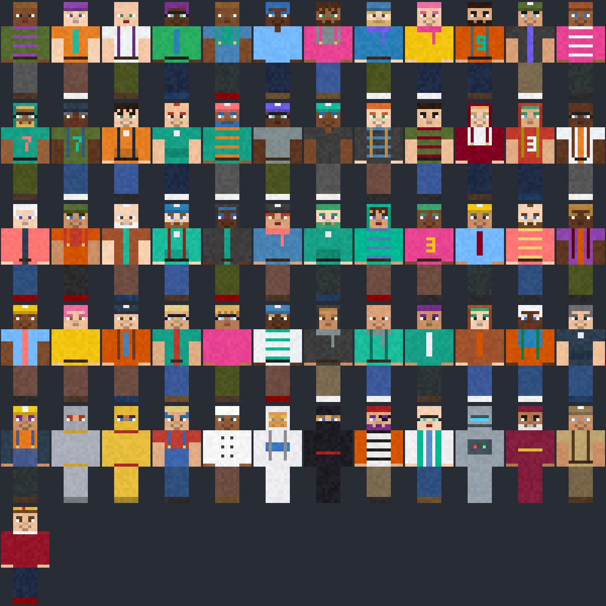

# Xen's skin pack

61 original Minecraft skins (`xen-01.png` ... `xen-61.png`, and all of them in `preview.png`), drawn by
[`scripts/make_skins.py`](../../scripts/make_skins.py): 48 varied people and 13 themed ones (miner, knight, gold
knight, farmer, chef, astronaut, ninja, pirate, scientist, robot, wizard, explorer, royal).

They're free to use for anything: [CC0 1.0](https://creativecommons.org/publicdomain/zero/1.0/) (public domain).

The mod carries them signed (`mod/common/resources/assets/xen/skins/pack.json`: each one was uploaded once, unlisted,
to mineskin.org, which returns a texture signed by Mojang), so every player sees them, with or without the mod.
`python scripts/make_skins.py --sign` draws and signs them again.

